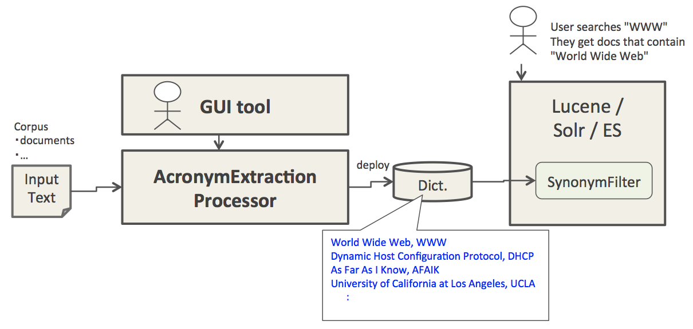

# NLP4L-DICT: Acronym Extraction 

## Overview

The acronym extraction solution outputs a lists of acronym - expansion pairs from natural language text written in various languages including English. Sample outputs are as follows.

```
World Wide Web, WWW
Dynamic Host Configuration Protocol, Dynamic Host Configuration Protocol
As Far As I Know, AFAIK
University of California at Los Angeles, UCLA
```

The acronym extraction of NLP4L implements the Simple Canonical method that is one of 4 methods introduced in a research paper [Acrophile: an automated acronym extractor and server](http://dl.a centimeters.org/citation.cfm?id=336664).

### Usage Scenario 

Using the acronym extraction solution to output a lists of acronym - expansion pairs and apply the output file to Lucene SynonymFilter enables high-recall search.



## Playing with Examples (Acronym Extraction)

To understand the acronym extraction solution of NLP4L, let's look at the attached examples.

You can find example configuration files that use the acronym extraction solution in the examples directory. Run them and see for yourself.

|sample|config file|
|:--|:--|
|Setting example to extract acronyms from sample English text|examples/example-acronym.conf|

## Configuration

### Class Setting

Specify org.nlp4l.framework.builtin.acronym.AcronymExtractionProcessorFactory as the class name.

Refer to the following configuration.

```
 processors : [
  {
   class : org.nlp4l.framework.builtin.acronym.AcronymExtractionProcessorFactory
   settings : {
    textField:  "text"
    algorithm:  "simpleCanonical"  // TODO: algorithm parameter is ignored now.
   }
  }
]
```

### Settings

Settings available for the acronym extraction processor are as follows.

|name|required|default|description|
|:--|:--:|:--:|:--|
|textField|true||Specify the name of text field where acronyms are extracted from.|
|algorithm|true|simpleCanonical|Specify an extraction algorithm. Not available and is ignored for now.|

### Output Dictionary

As the acronym extraction processor outputs the result to the acronyms cells, it would be better to use GenericDictionaryAttributeFactory as follows.

```
{
 dictionary : [
  {
   class : org.nlp4l.framework.builtin.GenericDictionaryAttributeFactory
   settings : {
    name: "AcronymsResultDict"
    attributes : [
     { name: "acronyms" }
   ]
   }
  }
]
}
```
