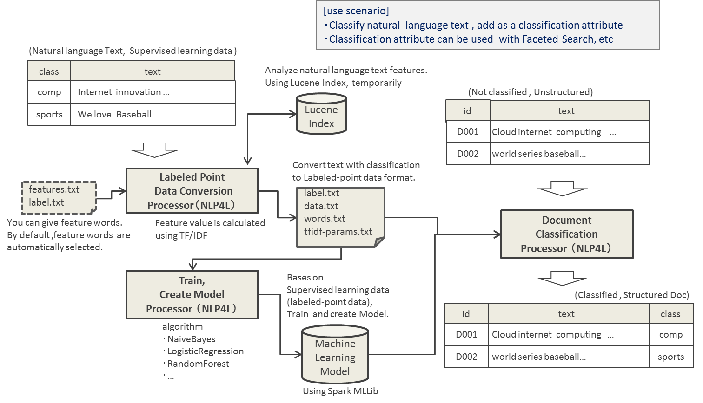

# NLP4L-DICT： 文書分類


## 概要

NLP4Lの文書分類ソリューションは、自然言語で書かれたテキストを解析し、その特徴量をもとに、カテゴリー分類する機能を提供します。

分類には、[Apache Spark (http://spark.apache.org/)](http://spark.apache.org/)で提供されているMachine Learning Library (MLlib)が使用されています。NLP4Lの提供する文書分類は、多クラス分類（Multi-Class Classification）です。

下記の図をご覧ください。ここでは文書分類の処理概要と、典型的な文書分類の利用シナリオが描かれています。



もう少し詳しく見ていきましょう。

#### Labeded-pointデータ形式への変換
文書分類は教師あり学習のため、教師データとしてカテゴリーがつけられた記事を（なるべくたくさん）用意する必要があります。

この教師データのテキストから、単語のTF/IDF値を算出して特徴量とし、その特徴量データをLabeled-point形式のデータに変換します。特徴となる単語は、デフォルトでは自動的にテキスト文書から抽出されますが、外部ファイルから与えることも可能です。
（内部的には、文書の特徴とTF/IDF値の算出のため、一時的に、LuceneのIndexに登録して利用しています。）

#### 訓練と学習モデルの作成
次に、Labeled-pointデータとして出力された教師データを読み込んで、機械学習による訓練(Training)を行い、学習モデルを作成します。

この機械学習には、Apache SparkのMLlibを使用しており、分類は多クラス分類となります。アルゴリズムは、デフォルトではNaiveBayesが使用され、設定によりLogisticRegressionやDecisionTree/RandomForestなども使用することが出来ます。

#### 文書の分類

学習モデルを作成したら、それを使ってカテゴリーが振られていない文書を分類できるようになります。

分類を行うには、これら未分類のテキスト文書からも、特徴量を算出する必要があるため、算出元のTF/IDF情報やパラメータも与えます。そして、未分類テキストの特徴量を、訓練済み機械学習モデルに適用して、分類していきます。


### 利用シナリオ


文書分類ソリューションを利用すると、非構造文書に対して分類属性を追加することができるので、構造化文書として扱えるようになります。これにより、ファセットを使った絞り込み検索が使えるようになり、[漸次的精度改善](../overview_ja.md#漸次的精度改善)に役立ちます。

## サンプルを試してみる (文書分類)

NLP4Lの文書分類ソリューションを理解するために、付属のサンプルを見てみましょう。

文書分類ソリューションを使用したサンプルのコンフィグレーションファイルが、exmaplesディレクトリに同梱されていますので、実際に動かして、試して見てください。

|sample|config file|
|:--|:--|
|Labeded-pointデータ形式への変換|examples/example-spark-mllib-labeled-point.conf|
|訓練と学習モデルの作成|examples/example-spark-mllib-train-model.conf|
|文書の分類|examples/example-spark-mllib-classification.conf|


## Processors

これまで見てきたように、文書分類ソリューションは3つのステップに分かれており、それぞれに対応するProcessorが提供されています。

|processor|description|
|:--|:--|
|LabeledPointProcessor|教師データを読み込んで、特徴量を算出し、Labeled-pointデータ形式への変換を行う。|
|TrainAndModelProcessor|Labeled-pointデータを元に、訓練と学習モデルの作成を行う。|
|ClassificationProcessor|学習モデルを使用して、未分類文書に対して分類を行う。|

以下では、それぞれのProcessorのConfugurationを説明します。

## Configuration (文書分類)

## LabeledPointProcessor
### class設定
LabeledPointProcessorのclass名には、org.nlp4l.framework.builtin.spark.mllib.LabeledPointProcessorFactory と指定します。

### settings設定

LabeledPointProcessorで設定可能なsettingsは、以下の通りです。

|name|required|default|description|
|:--|:--:|:--:|:--|
|labelField|true||教師データの分類ラベルのフィールド名を指定します。<br>例: "category"|
|textField|true||教師データのテキストフィールド名を指定します。<br>例: "text"|
|modelDir|true||データファイル出力やモデル作成に使用されるディレクトリを指定します。<br>例: "/opt/nlp4l/example-doc-class"|
|analyzer|true||テキストフィールドを分析するための、LuceneのAnalyzerを指定します。<br>例:  {<br>class : org.apache.lucene.analysis.standard.StandardAnalyzer<br>}|
|labelFile|false|-|分類ラベルファイルを指定します。デフォルトでは、入力データの分類ラベルフィールドから抽出され、自動生成されます。<br>例: <br>"/opt/nlp4l/example-doc-class/label-in.txt"
|featuresFile|false|-|特徴となる単語ファイルを指定します。デフォルトでは、入力データのtextFieldから抽出され、自動生成されます。<br>例: <br>"/opt/nlp4l/example-doc-class/features-in.txt"
|maxDFPercent|false|99|TF-IDF値算出用パラメータ: max document frequency (%)<br>例: 99|
|minDF|false|1|TF-IDF値算出用パラメータ: min document frequency<br>例: 1|
|maxFeatures|false|-1|TF-IDF値算出用パラメータ: max features<br>例: -1<br>-1とした場合、すべての単語が特徴語として抽出されます。|
|tfMode|false|n|TF-IDF値算出用パラメータ: TF mode<br>例: "n"<br>tfModeは、n/l/m/b/L/w が設定可能です。算出式(*1)を参照。|
|smthTerm|false|0.4|TF-IDF値算出用パラメータ: smoothing param<br>例: 0.4|
|idfMode|false|t|TF-IDF値算出用パラメータ: IDF mode<br>例: "t"<br>idfMode、n/t/T/p/P が設定可能です。算出式(*2)を参照。|
|termBoostsFile|false|-|TF-IDF値算出用パラメータ: term boosts file<br>例: "/opt/nlp4l/example-doc-class/termBoosts.txt"

```
(*1) tfMode
n/l/m/b/L/w (default=n)

n:  TF
l:  1 + math.log(TF)
m:  smthTerm + (smthTerm * TF) / maxTF
b:  if (TF > 0) 1.0 else 0.0
L:  (1 + math.log(TF)) / (1 + math.log(aveTF))
w:  if (TF > 0) 1 + math.log(TF) else 0.0

TF: term freq on the doc.
smthTerm: smthTerm (default=4.0)
aveTF : the average of TF in the document
maxTF : the max term frequency in the whole documents

```

```
(*2) idfMode
n/t/T/p/P (default=t)

n: 1
t: math.log(numDocs / DF)
T: math.log(numDocs+1 / DF+1)
p: math.max(0, math.log((numDocs - DF) / DF))
P: math.max(0, math.log((numDocs+1 - DF+1) / DF+1))

numDocs: total num of documents
DF: document frequency for the term
```


以下のコンフィグレーション例を参考にしてください。

```
{
  processors : [
    {
      class : org.nlp4l.framework.builtin.spark.mllib.LabeledPointProcessorFactory
      settings : {
        labelField:  "category"
        textField:   "text"
        modelDir:    "/opt/nlp4l/example-doc-class"
        analyzer : {
          class : org.apache.lucene.analysis.standard.StandardAnalyzer
        }
      }
    }
  ]
}

```

### 出力ファイルおよび Dictionary

LabeledPointProcessorの実行結果として出力されるDictionaryは、実行終了を告げるテキストのみ("success"と表示)です。


また、実行結果として、settings設定のmodelDirで指定したディレクトリに、以下のファイルが出力されます。

|file|description|
|:--|:--|
|data.txt|Labeled-pointデータのファイル。(LibSVM形式)|
|label.txt|分類ラベルのファイル。ラベルのインデックス値(0から始まる)とラベルの名称に関する情報。|
|words.txt|特徴語のファイル。特徴量算出の対象となった単語に関する情報。
|tfidf-params.txt|TF/IDF値の算出で使用したパラメータ情報。|
|lucene|一時的に作成したLuceneのindexディレクトリ。(この後の文書分類処理では使用しません)|


## TrainAndModelProcessor
### class設定
TrainAndModelProcessorのclass名には、org.nlp4l.framework.builtin.spark.mllib.TrainAndModelProcessorFactory と指定します。

### settings設定

TrainAndModelProcessorで設定可能なsettingsは、以下の通りです。

|name|required|default|description|
|:--|:--:|:--:|:--|
|modelDir|true||モデル作成に使用されるディレクトリを指定します。<br>例: "/opt/nlp4l/example-doc-class"|
|algorithm|false|NaiveBayes|アルゴリズムを指定します。以下が設定可能なアルゴリズムです。<br>- NaiveBayes<br>- LogisticRegressionWithLBFGS<br>- DecisionTree<br>- RandomForest<br>例: "NaiveBayes"|
|algorithmParams|false|-|アルゴリズムに引き渡すパラメータを指定します。<br>例: {<br>lambda: 1.0<br>modelType: "multinomial"<br>}|
|trainTestRate|false|0.7|インプットデータのうち、訓練(Training)に使う割合を指定します。残りのデータはテストに使用されます。0.7と指定した場合、70%のデータで訓練し、作成した学習モデルに対して、30%のデータでテストして、モデルの性能を測定します。<br>例: 0.7|


以下のコンフィグレーション例を参考にしてください。
```
{
  processors : [
    {
      class : org.nlp4l.framework.builtin.spark.mllib.TrainAndModelProcessorFactory
      settings : {
        modelDir:     "/opt/nlp4l/example-doc-class"
        algorithm:    "NaiveBayes"
        trainTestRate: 0.7
      }
    }
  ]
}

```

### 出力ファイルおよび Dictionary


TrainAndModelProcessorの実行結果として出力されるDictionaryは、実行終了を告げるテキストのみです。
結果テキストメッセージには、学習モデルを用いたテスト処理の結果測定値としてメトリクス情報("precision = 0.xx..."と表示)も出力されます。

また、実行結果として、settings設定のmodelDirで指定したディレクトリに、学習モデルファイル(ディレクトリ)が作成されます。


## ClassificationProcessor
### class設定
ClassificationProcessorのclass名には、org.nlp4l.framework.builtin.spark.mllib.ClassificationProcessorFactory と指定します。

### settings設定

ClassificationProcessorで設定可能なsettingsは、以下の通りです。

|name|required|default|description|
|:--|:--:|:--:|:--|
|modelDir|true||学習モデルが配置されているディレクトリを指定します。<br>例: <br>"/opt/nlp4l/example-doc-class"|
|textField|true||分類対象のテキストフィールド名を指定します。<br>例: "text"|
|idField|true||分類対象の文書IDフィールド名を指定します。<br>例: "docId"|
|algorithm|false|NaiveBayes|アルゴリズムを指定します。以下が設定可能なアルゴリズムです。モデルを作成した際に使用したアルゴリズムと同じものを指定する必要があります。<br>- NaiveBayes<br>- LogisticRegressionWithLBFGS<br>- DecisionTree<br>- RandomForest<br>例: "NaiveBayes"|
|analyzer|true||テキストフィールドを分析するための、Analyzerを指定します。<br>例:  {<br>class : org.apache.lucene.analysis.standard.StandardAnalyzer<br>}|
|passThruFields|false| - |入力文書のフィールド値をそのまま出力したいフィールド名を指定します。文書のタイトルやテキストフィールドなどを指定できます。複数のフィールドを指定可能なため、配列形式で定義します。<br>例:["title", "text"]

以下のコンフィグレーション例を参考にしてください。

```
{
  processors : [
    {
      class : org.nlp4l.framework.builtin.spark.mllib.ClassificationProcessorFactory
      settings : {
        textField:      "text"
        idField:        "docId"
        passThruFields: [ "title", "text" ]
        modelDir:     "/opt/nlp4l/example-doc-class"
        algorithm:    "NaiveBayes"
        analyzer : {
          class : org.apache.lucene.analysis.standard.StandardAnalyzer
        }
      }
    }
  ]
}

```

### 出力 Dictionary

ClassificationProcessorの実行結果として出力されるDictionaryは、settings設定により、以下のようになります。

- idField(docId)は、必須項目で、そのまま出力項目となります。
- textField(text)で指定したフィールドを、分類処理した結果のラベル名が、"classification"フィールドに出力されます。
- passThruFields(text, title)を指定すると、そのままの値が、出力項目として、出力されます。


