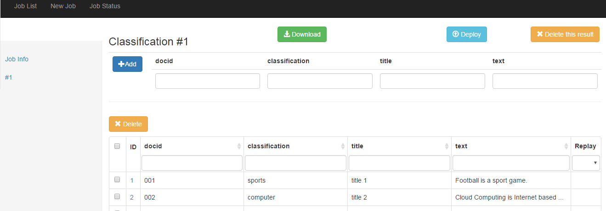

# NLP4L-DICT: Downloading and Deploying a Dictionary


## Overview

The Dictionary Creation Integration Tool of NLP4L provides a function that outputs created dictionary data to a file to download. It also provides a mechanism to directly deploy the dictionary to a server (search engine).

Simply set the Config file as follows to enable the download and deploy functions.

To output the created dictionary data to a file, set up a component called Writer (Writers for outputting in the JSON file format and the CSV file format are provided as standard). Also, to directly deploy to a server, set up a component called Deployer. You can set up Writer only if you don't need to deploy. How you can set up Writer and Deployer will be explained later.


The Download button will be displayed in the GUI tool when you set Writer. Pressing the Download button will run Writer, and you will be able to download the file output by Writer from the browser.

The Deploy button will be displayed when you set Deployer. Pressing the Deploy button will run Writer first, and then Deployer will process the file that Writer output.




## Writer

To output dictionary data to a file, you need to set up Writer.

The standard packaging includes Writers to output in the JSON file format and in the CSV file format.

### Setting JsonFileWriter
Refer to the following sample configuration.
```
{
 processors : [
  {
   class : ...
   settings : ...
  }
 ]
 writer : {
  class : org.nlp4l.framework.builtin.JsonFileWriterFactory
  settings : {
   file : "/tmp/nlp4l-ner-dict.json"
  }
 }
}

```
Settings available for JsonFileWriter are as follows.

|name|required|default|description|
|:--|:--:|:--:|:--|
|file|false||Output file for Writer<br>If omitted, a file will be auto-generated in the system temporary directory. <br>Ex: "/tmp/result-dict.json"|

### Setting CSVFileWriter
Refer to the following sample configuration.
```
{
 processors : [
  {
   class : ...
   settings : ...
  }
 ]
 writer : {
  class : org.nlp4l.framework.builtin.CSVFileWriterFactory
  settings : {
   file : "/tmp/nlp4l-doc-clss-dict.csv"
   separator : ","
   encoding : "UTF-8"
  }
 }
}

```
Settings available for CSVFileWriter are as follows.

|name|required|default|description|
|:--|:--:|:--:|:--|
|file|false||Output file for Writer<br>If omitted, a file will be auto-generated in the system temporary directory. <br>Ex: "/tmp/result-dict.csv"|
|separator|false|","(comma)| delimiter<br>Ex: ",", "&#124;" and etc.|
|encoding|false|UTF-8|Character code for the output file<br>Ex: "UTF-8"|

## Deployer

To deploy the file output from Writer, you need to set up Deployer.

The standard packaging includes Deployer to transmit file in HTTP.

### Setting HttpFileTransferDeployer
Refer to the following sample configuration.
```
{
 processors : [
  {
   class : ...
   settings : ...
  }
 ]
 writer : {
  class : org.nlp4l.framework.builtin.CSVFileWriterFactory
  settings : {
   file : "/tmp/nlp4l-doc-clss-dict.csv"
   separator : ","
   encoding : "UTF-8"
  }
 }
 deployer : {
  class : org.nlp4l.framework.builtin.HttpFileTransferDeployerFactory
  settings : {
   deployToUrl : "http://localhost:8983/FileReceiverServlet"
   deployToFile : "/opt/solr/nlp4l/doc-class-dict.csv"
  }
 }
}

```
Settings available for HttpFileTransferDeployer are as follows.

|name|required|default|description|
|:--|:--:|:--:|:--|
|deployToUrl|true||URL to deploy to<br>Ex: "http://localhost:8983/FileReceiverServlet"|
|deployToFile|true||File name used for saving<br>Ex: "/opt/solr/nlp4l/doc-class-dict.csv"|

When you are using HttpFileTransferDeployer, you additionally need to set up the server to receive file (Servlet and so forth).
