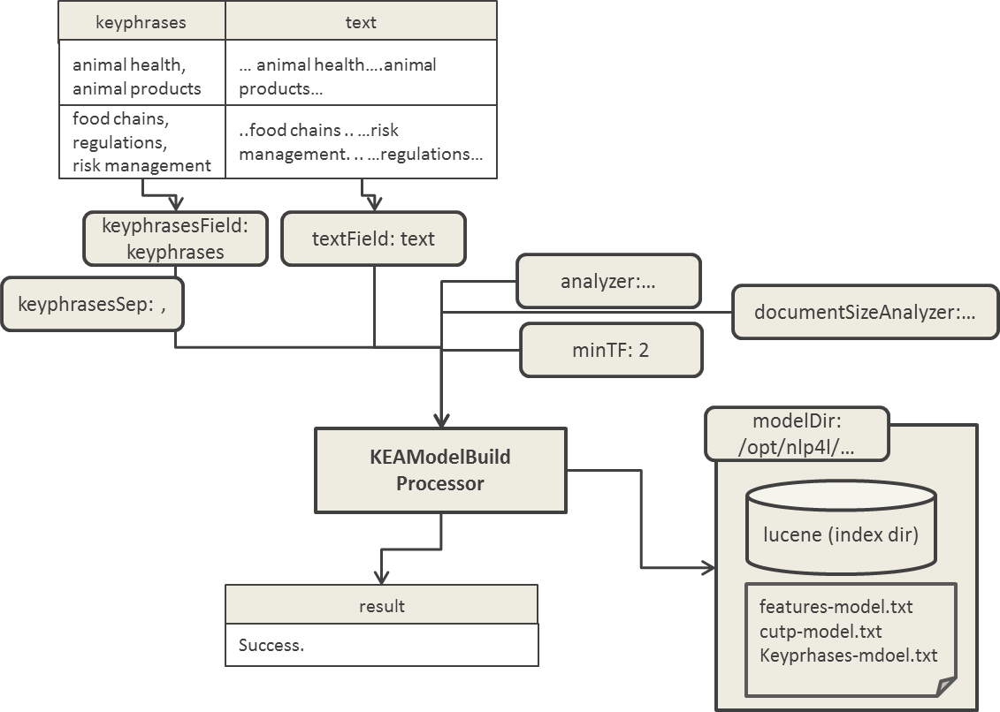

# NLP4L-DICT: Keyphrase Extraction 


## Overview

The keyphrase extraction solution of NLP4L provides a function to extract keyphrases (keywords) from text written in natural language.

Keyphrases to be extracted are 1 to up to 3 successive words (1-Gram, 2-Gram, and 3-Gram).

This keyphrase extraction is based on KEA algorithm. [KEA](http://www.nzdl.org/Kea/) is a program to automatically extract keyphrases (keywords) from documents written in natural language and was developed at University of Waikato in New Zealand. KEA stands for Keyphrase Extraction Algorithm and also means algorithm itself that constitutes the KEA program.

Look at the following diagram. The diagram describes process overview and usage scenarios of keyphrase extraction.


Let's look at in details. 

#### Creating Learning Models

Keyphrase extraction is supervised learning. Therefore, pairs of document and a set of keyphrases extracted from it are needed as the training data.

#### Extracting Keyphrases

Once learning models are created, input unknown documents and perform keyphrase extraction.

 (In order to obtain text analysis and word statistic, a document is temporarily added to Lucene Index.) 


### Usage Scenarios

You can obtain buzzwords specific to business domain of each user because you can extract keyphrases from your corpus. Thus, using this as data sources of keyword suggestion (auto-complete) and "Did you mean" search may help improving users' search experience. 
In addition, it would give users smarter impression than simple word suggestion because the extractable character string is "a phrase consists of one or more words".

## Playing with Examples (keyphrase extraction)

Let's look at the included examples to understand the NLP4L keyphrase extraction solution.

There are example configuration files, which uses the keyphrase extraction solution, in the examples directory. Play with them in practice.

|sample|config file|
|:--|:--|
|Creating Learning Models|examples/example-kea-model.conf|
|Keyphrase Extraction|examples/example-kea-extract.conf|


## Processors

As you have seen so far, the keyphrase extraction solution is divided into 2 processes with respective Processors provided.

|processor|description|
|:--|:--|
|KEAModelBuildProcessor|Create learning models based on the training data.|
|KeyphraseExtractionProcessor|Use the created learning models to extract keyphrases from unknown documents.|

Configuration of each Processor is Explained in the Following.

## Configuration (Document Classification)

## KEAModelBuildProcessor

### Class Setting

Specify org.nlp4l.framework.builtin.kea.KEAModelBuildProcessorFactory as the class name of KEAModelBuildProcessor.

### Settings

Settings available for KEAModelBuildProcessor are as follows.

|name|required|default|description|
|:--|:--:|:--:|:--|
|keyphrasesField|true||Specify the name of field to output extracted keyphrase. <br>Ex: "keyphrases"|
|keyphrasesSep|false|","(Comma)|Specify the delimiter to use when more than one keyphrase is output.<br>Ex: ",", "&#124;", etc.|
|textField|true||Specify the name of text field to extract keyphrase from.<br>Ex: "text"|
|modelDir|true||Specify the directory where models are created.<br>Ex: "/opt/nlp4l/example-kea-class"|
|analyzer|false|-|Specify Analyzer to analyze text fields. <br>Ex: {<br>class : org.nlp4l.framework.builtin.kea.KEAStandardAnalyzer<br>}|
|documentSizeAnalyzer|false|-|Specify Analyzer to analyze the document size.<br>Ex: {<br>tokenizer { factory : whitespace }<br>}|
|minTF|false|2|Specify the least number of word (phrase) occurrence.<br>Ex: 2|


Refer to the following example configuration.
```
{
 processors : [
  {
   class : org.nlp4l.framework.builtin.kea.KEAModelBuildProcessorFactory
   settings : {
    keyphrasesField: "keyphrases"
    textField:    "text"
    modelDir:     "/opt/nlp4l/example-kea"
   }
  }
 ]
}

```

### Output File and Dictionary

The Dictionary KEAModelBuildProcessor outputs as an execution result only includes the successful text message ("success" is displayed).



Also, as another execution result, following files are output to the directory that is specified by modelDir in settings.

|file|description|
|:--|:--|
|features-model.txt|Learning model file consists of Feature amounts in real number.|
|cupt-model.txt|Feature amount in discrete value data calculated using MDLP (Minimum Description Length Principle)|
|keyphrases-model.txt|Feature data information of keyphrases used while creating models (mainly for debug use).
|lucene-inex-model|Lucene index directory created for text analysis.|


## KeyphraseExtractionProcessor
### Class Setting
Specify org.nlp4l.framework.builtin.spark.mllib.KeyphraseExtractionProcessorFactory to the class name of KeyphraseExtractionProcessor.

### Settings

Settings available for KeyphraseExtractionProcessor are as follows.

|name|required|default|description|
|:--|:--:|:--:|:--|
|idField|true||Specify the name of document ID field of input document.<br>Ex: "docId"|
|textField|true||Specify the name of text field in input document you extract keyphrases from.<br>Ex: "text"|
|modelDir|true||Specify the directory you placed learning models. <br>Ex: <br>"/opt/nlp4l/example-kea"|
|keyphrasesSep|false|","(comma)|Specify the delimiter to use when there is more than one keyphrase.<br>Ex: "," , "&#124;", and etc.|
|passThruFields|false| - |Specify when the value of input data will be output without any change. You can specify document title, text field, and so forth. Define in the array format because you can specify more than one field.<br>例:["title", "text"]
|maxKeyphrases|false|20|The maximum number of keyphrases extracted.<br>Ex: 20|
|scoreThreshold|false|0.0|The lowest limit of keyphrase score extracted. Keyphrases with this score or better will be extracted. <br>Ex: 0.5|
|incrementDfDocNum|false|true|Whether to add 1 to DF(Document Freq) and the total number of documents in place of unknown document before calculating TF/IDF.<br>Ex: true|
|nGramPriorityOrder|false|3,2,1|Specify the priority of N-gram. The N-gram priority specified here is used If the score and TF/IDF values are the same.<br>Ex: 3,2,1|
|analyzer|false|-|Specify Analyzer to analyze text fields<br>Ex: {<br>class : org.nlp4l.framework.builtin.kea.KEAStandardAnalyzer<br>}|
|documentSizeAnalyzer|false|-|Specify Analyzer to analyze the document size.<br>Ex: {<br>tokenizer { factory : whitespace }<br>}|
|minTF|false|2|Specify the least number of word (phrase) occurrence.<br>Ex: 2|


Refer to the following example configuration.
```
{
 processors : [
  {
   class : org.nlp4l.framework.builtin.kea.KeyphraseExtractionProcessorFactory
   settings : {
    idField:   "docId"
    textField:  "text"
    modelDir:  "/opt/nlp4l/example-kea"
    passThruFields: [
     "text"
    ]
   }
  }
 ]
}

```

### Output Dictionary

The Dictionary, which is output as an execution result of KeyphraseExtractionProcessor, will be as follows depending on your settings.

- idField(docId) is required item and will be an output item without any change.
- Keyphrases extracted from fields specified by textField(text) is output to the "keyphrases" field. The value specified in keyphrasesSep (the default is ",") is used as a delimiter if there is more than one keyphrase.
- Specifying passThruFields(text, title) will output a value as an output item without any change.


