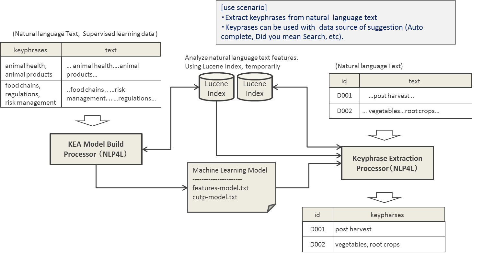
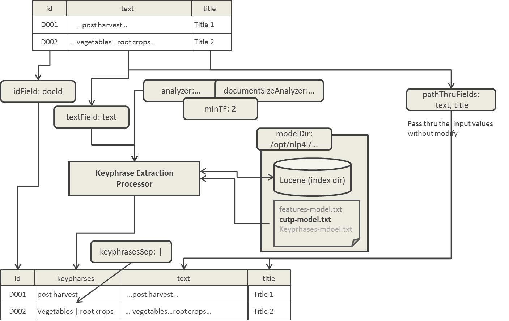

# NLP4L-DICT： キーフレーズ抽出


## 概要

### Overview

NLP4Lの提供するキーフレーズ抽出ソリューションは、自然言語テキストからキーフレーズ（キーワード）を抽出する機能を提供します。

抽出されるキーフレーズは、1つから最大3つの連続する単語(1-Gram、2-Gram、および、3-Gram)を対象としています。

キーフレーズ抽出は、KEAアルゴリズムに基づいて、実現されています。[KEA](http://www.nzdl.org/Kea/)は、ニュージーランドのワイカト大学で開発されている、自然言語で書かれた文書からキーフレーズ（キーワード）を自動抽出するプログラムです。KEAはKeyphrase Extraction Algorithmの略であり、KEAプログラムを構成するアルゴリズムそのものを指す場合もあります。

下記の図をご覧ください。ここではキーフレーズ抽出の処理概要と利用シナリオが描かれています。



もう少し詳しく見ていきましょう。

##### 学習モデルの作成
NLP4Lのキーフレーズ抽出では、教師あり機械学習を使用するため、まず、予めキーフレーズ抽出された文書(教師ありデータ)を与え、学習モデルを作成します。


##### キーフレーズの抽出
学習モデルが作成されると、テキスト文書を与え、訓練済み機械学習モデルに基づいた、キーフレーズ抽出を行います。

（内部的には、テキスト解析をやり易くするため、一時的に、LuceneのIndexに登録して利用しています。）


### Use Scenario


キーフレーズ抽出ソリューションを利用することで、自然言語テキストからキーフレーズを抽出し、サジェスト(オートコンプリート、もしかして検索など)のデータソースとして利用するなど、様々な局面で利用することが考えられます。

## Play with Example (キーフレーズ抽出)

NLP4Lの提供するキーフレーズ抽出ソリューションの理解を進めるには、付属のサンプルを見てみるのが近道でしょう。

キーフレーズ抽出ソリューションを使用したサンプルのコンフィグレーションファイルが、exmaplesディレクトリに同梱されていますので、実際に動かして、試して見てください。

|sample|config file|
|:--|:--|
|学習モデルの作成|examples/example-kea-model.conf|
|キーフレーズの抽出|examples/example-kea-extract.conf|


## Processors

これまで見てきたように、キーフレーズ抽出ソリューションでは、2つのステップに処理が分かれており、それぞれに対応するProcessorが提供されています。

|processor|description|
|:--|:--|
|KEAModelBuildProcessor|教師ありデータを基づいて、学習モデルの作成を行う。|
|KeyphraseExtractionProcessor|テキスト文書から、学習モデルを使用して、キーフレーズ抽出を行う。|

以下では、それぞれのProcessorのConfugurationを説明します。

## Configuration (文書分類)

## KEAModelBuildProcessor
### class設定
KEAModelBuildProcessorのclass名には、org.nlp4l.framework.builtin.kea.KEAModelBuildProcessorFactory と指定します。

### settings設定

KEAModelBuildProcessorで設定可能なsettingsは、以下の通りです。

|name|required|default|description|
|:--|:--:|:--:|:--|
|keyphrasesField|true||インプットとなる教師あり(予め分類された)データのキーフレーズフィールド名を指定します。<br>例: "keyphrases"|
|keyphrasesSep|false|","(カンマ)|キーフレーズが複数存在する場合の区切り文字<br>例："," や "&#124;" など|
|textField|true||インプットとなる教師あり(予め分類された)データのテキストフィールド名を指定します。<br>例: "text"|
|modelDir|true||モデル作成に使用されるディレクトリを指定します。<br>例: "/opt/nlp4l/example-kea-class"|
|analyzer|false|-|テキストフィールドを分析するための、Analyzerを指定します。<br>例:  {<br>class : org.nlp4l.framework.builtin.kea.KEAStandardAnalyzer<br>}|
|documentSizeAnalyzer|false|-|文書サイズを分析するための、Analyzerを指定します。<br>例:  {<br>tokenizer { factory : whitespace }<br>}|
|minTF|false|2|最少単語(フレーズ)出現回数を指定します。<br>例: 2|


以下のコンフィグレーション例を参考にしてください。
```
{
  processors : [
    {
      class : org.nlp4l.framework.builtin.kea.KEAModelBuildProcessorFactory
      settings : {
        keyphrasesField:  "keyphrases"
        textField:        "text"
        modelDir:         "/opt/nlp4l/example-kea"
      }
    }
  ]
}

```

### Output Files & Dictionary

KEAModelBuildProcessorの実行結果として出力されるDictionaryは、実行終了を告げるテキストのみ("success"と表示)です。


また、実行結果として、settings設定のmodelDirで指定したディレクトリに、以下のファイルが出力されます。

|file|description|
|:--|:--|
|features-model.txt|特徴量の実数値の学習モデルファイル。|
|cupt-model.txt|特徴量をMDLP（最小記述長原理）により求めた離散値の学習モデル。|
|keyphrases-model.txt|モデル作成に使用したキーフレーズの特徴データ情報(主にデバッグ用)。
|lucene-inex-model|テキスト解析用に作成したLuceneのindexディレクトリ。|


## KeyphraseExtractionProcessor
### class設定
KeyphraseExtractionProcessorのclass名には、org.nlp4l.framework.builtin.spark.mllib.KeyphraseExtractionProcessorFactory と指定します。

### settings設定

KeyphraseExtractionProcessor、以下の通りです。

|name|required|default|description|
|:--|:--:|:--:|:--|
|idField|true||インプットとなる文書IDフィールドを指定します。<br>例: "docId"|
|textField|true||インプットとなる文書のテキストフィールドを指定します。<br>例: "text"|
|modelDir|true||学習モデルを配置したディレクトリを指定します。<br>例: <br>"/opt/nlp4l/example-kea"|
|keyphrasesSep|false|","(カンマ)|キーフレーズが複数存在する場合の区切り文字<br>例："," や "&#124;" など|
|passThruFields|false| - |インプットデータの値をそのまま出力とする場合に指定します。文書のタイトルやテキストフィールドなどを指定できます。複数のフィールドを指定可能なため、配列形式で定義します。<br>例:[”title", "text"]
|maxKeyphrases|false|20|抽出されるキーフレーズの最大数。<br>例: 20|
|scoreThreshold|false|0.0|抽出されるキーフレーズのスコアの最低ライン。このスコア以上のキーフレーズが抽出されます。<br>例: 0.5|
|incrementDfDocNum|false|true|DF(document freq)と総ドキュメント数に、未知文書分として、1を加算してからTF/IDF計算するか否か。<br>例: true|
|nGramPriorityOrder|false|3,2,1|Nグラムの優先順を指定します。スコアとTF/IDF値が同じ場合、ここで指定したNグラム優先順が使用されます。<br>例: 3,2,1|
|analyzer|false|-|テキストフィールドを分析するための、Analyzerを指定します。<br>例:  {<br>class : org.nlp4l.framework.builtin.kea.KEAStandardAnalyzer<br>}|
|documentSizeAnalyzer|false|-|文書サイズを分析するための、Analyzerを指定します。<br>例:  {<br>tokenizer { factory : whitespace }<br>}|
|minTF|false|2|最少単語(フレーズ)出現回数を指定します。<br>例: 2|


以下のコンフィグレーション例を参考にしてください。
```
{
  processors : [
    {
      class : org.nlp4l.framework.builtin.kea.KeyphraseExtractionProcessorFactory
      settings : {
        idField:     "docId"
        textField:   "text"
        modelDir:    "/opt/nlp4l/example-kea"
        passThruFields: [
          "text"
        ]
      }
    }
  ]
}

```

### Output Dictionary

KeyphraseExtractionProcessorの実行結果として出力されるDictionaryは、settings設定により、以下のようになります。

- idField(docId)は、必須項目で、そのまま出力項目となります。
- textField(text)で指定したフィールドから抽出されたキーフレーズが、"keyphrases"フィールドに出力されます。キーフレーズが複数の場合、keyphrasesSep(デフォルトは",")で指定した値が区切り文字として使用されます。
- passThruFields(text, title)を指定すると、そのままの値が、出力項目として、出力されます。





以上

