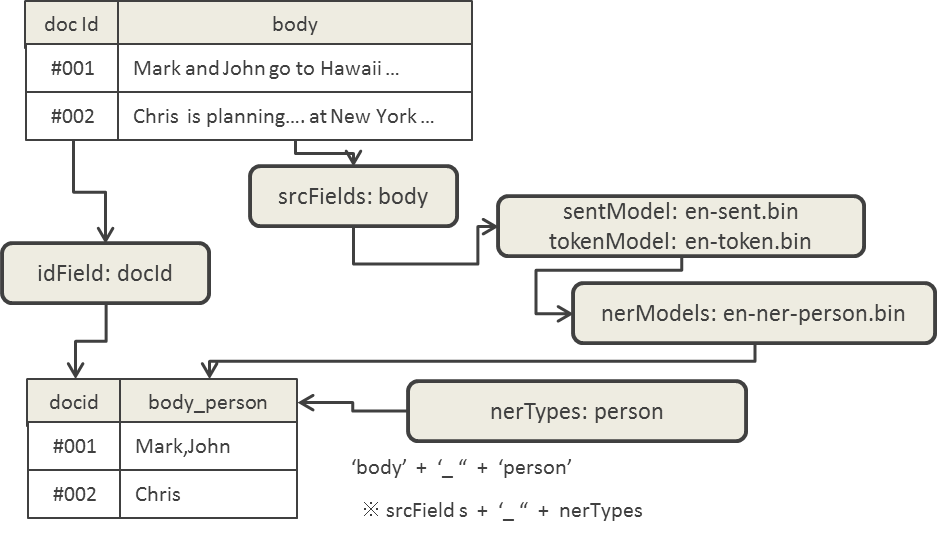

# NLP4L-DICT: Named Entity Extraction 


## Overview

The named entity extraction solution that NLP4L provides is a function to extract named entities (names of people, locations, organizations, dollar figures, dates, times, etc) from text written in natural language.

Extraction of named entity is realized by using trained models of Name Finder that are provided at [Apache OpenNLP (http://opennlp.apache.org/)](http://opennlp.apache.org/).

### Usage Scenarios

Using named entity extraction solution, you can add attributes of named entity to unstructured documents written in natural language and use them as structured documents. This will enable you to use refinement search that uses facets.

The following diagram assumes a usage scenario that links extracted named entities to the target document ID and coalesce them into the original document while creating the index for search engine.


## Play with Example (Named Entity Extraction)

A shortcut to understand more about the named entity extraction solution that NLP4L provides is to take a look at the included examples.

Getting Started provides a tutorial that uses named entity extraction. Refer to this document for a sample of named entity extraction.

- Getting Started ([Japanese](../getting_started_ja.md)/[English](../getting_started.md))

## Configuration (Named Entity Extraction)

### Class Setting
Named entity extraction must be set as Record Processor because it is processed on every input record.
Specify org.nlp4l.framework.builtin.ner.OpenNLPNerRecordProcessorFactory as the class name.


Refer to the following configuration.

```
{
 processors : [
  {
   class : org.nlp4l.framework.processors.WrapProcessor
   recordProcessors : [
    {
     class : org.nlp4l.framework.builtin.ner.OpenNLPNerRecordProcessorFactory
     settings : {
      ...
     }
    }
   ]
  }
 ]
}
```

### Settings

Settings available for the named entity extraction processor are as follows.

|name|required|default|description|
|:--|:--:|:--:|:--|
|sentModel|true||Specify a model file for Sentence Detector of OpenNLP.<br>Ex.: "/opt/nlp4l/example-ner/models/en-sent.bin"|
|tokenModel|true||Specify a model file for Tokenizer of OpenNLP<br>Ex.: "/opt/nlp4l/example-ner/models/en-token.bin"|
|nerModels|true||Specify model files for Name Finder of OpenNLP. Define it in the array format because you can specify more than one model file.<br>Ex.: [<br>"/opt/nlp4l/example-ner/models/en-ner-person.bin",<br>"/opt/nlp4l/example-ner/models/en-ner-location.bin"<br>]
|nerTypes|true||Specify named entity types (names of people, locations, dollar figures, etc). Values specified here are used as the Cell name (column name) of output data. Define it in the array format because you can specify more than one named entity type. <br>Ex.: [<br>"person",<br>"location"<br>]
|srcFields|true||Specify field names for input data that the named entity extraction bases on. Define it in the array format because you can specify more than one field. <br>Ex.: [<br>"body",<br>"title"<br>]
|idField|true||Specify a field name for the document ID of input data. <br>Ex.: docId|
|passThruFields|false| - |Specify when you output the value of input data as it is. You can specify attributes including document title and classification, or fields that named entity extraction base on. Define it in the array format because you can specify more than one field.<br>Ex.: [<br>"category",<br>"title",<br>"body"<br>]
|separator|false|","(comma)|Delimiter used when there is more than one extracted named entity.<br>Ex: ",", "&#124;", and so forth.|


Refer to the following sample configuration.

```
{
 processors : [
  {
   class : org.nlp4l.framework.processors.WrapProcessor
   recordProcessors : [
    {
     class : org.nlp4l.framework.builtin.ner.OpenNLPNerRecordProcessorFactory
     settings : {
      sentModel: "/opt/nlp4l/example-ner/models/en-sent.bin"
      tokenModel: "/opt/nlp4l/example-ner/models/en-token.bin"
      nerModels: [
       "/opt/nlp4l/example-ner/models/en-ner-person.bin",
       "/opt/nlp4l/example-ner/models/en-ner-location.bin"
       ]
      nerTypes: [
       "person",
       "location"
      ]
      srcFields: [
       "body",
       "title"
      ]
      idField:  "docId"
      passThruFields: [
       "category",
       "title",
       "body"
      ]
      separator: "|"
     }
    }
   ]
  }
 ]
}

```

### Output Dictionary

The Dictionary output as an execution result of named entity extraction processor will be as follows depending on your settings.

#### When You Have Basic Setting

First, let's look at a case where there is one srcFields, which named entity extraction bases on, and one nerModels(model file) for named entity extraction.

Output Dictionary looks like the following diagram.

- idField(docId) is an essential item and becomes an output item as it is.
- The field name specified by srcFields(body) and the type name specified by nerTypes(person) are connected by underscore (_) to become character string (body_person) and becomes an output item for the extracted named entity.

nerModels is strictly for specifying model file and is not used for the name of output item. The one used for the name of output item is the setting for nerTypes.




#### When You Specify More Than One Model

Next, let's look at a case where there will be more than one model file specified.

- The field name specified by srcFields(body) and the type name specified by nerTypes(person and location) are connected by underscore (_) to become character string (body_person and body_location) and becomes an output item for the extracted named entity.


#### When You Specify More Than One Extraction Origin Field Specified 

In addition, let's look at a case where there will be more than one extraction origin field.

- The field name specified by srcFields(body and title) and the type name specified by nerTypes(person and location) are connected by underscore (_) to become character string (in the order corresponding to body_person, body_location, title_person, title_location) and becomes an output item for the extracted named entity.


#### Other Settings

Finally, let's look at other settings and output Dictionary.

- If there is more than one extracted named entity, delimiter (separator) specified in the settings is used to output Dictionary. By default, a comma (,) is used for the delimiter.
- When you specify pathThruFields, the value of original field can be output without being processed. You can also specify a value for src field of named entity extraction origin. The values, in that case, will be output without being processed.


