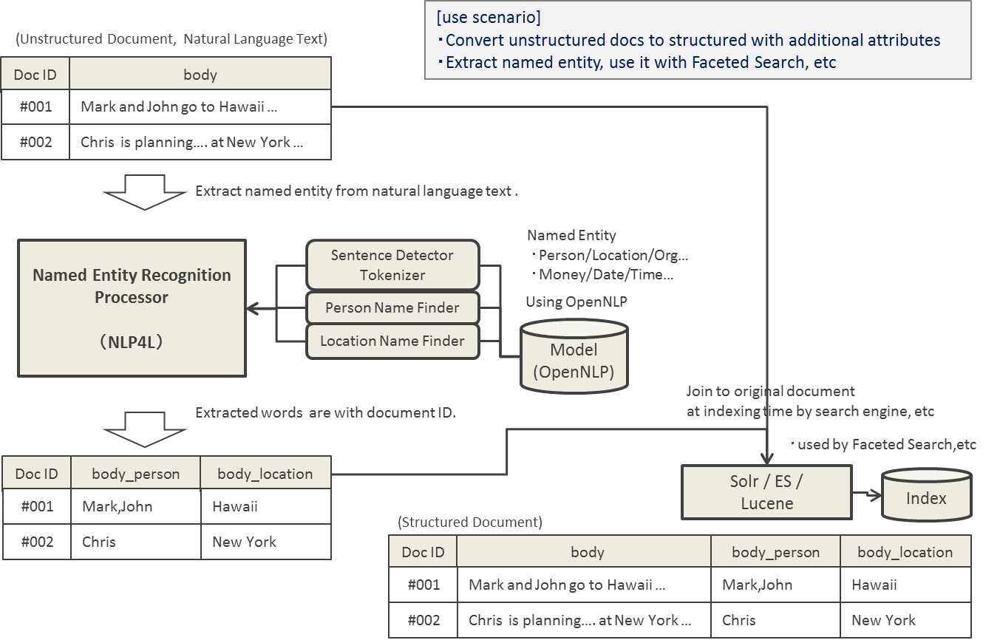
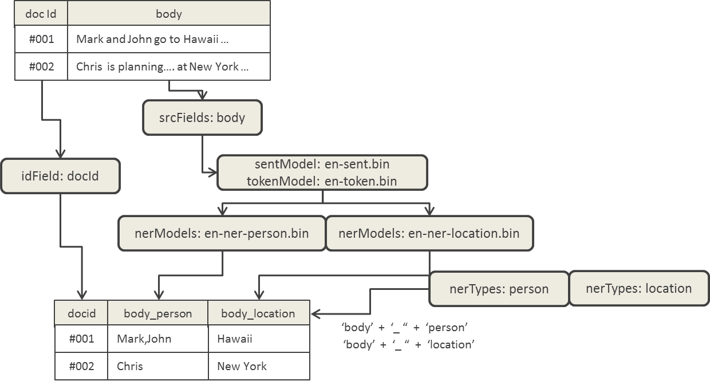

# NLP4L-DICT： 固有表現抽出


## 概要

### Overview

NLP4Lの提供する固有表現抽出ソリューションは、自然言語テキストから固有表現(人名、場所、組織、金額、日付、時間など)を切り出す機能を提供します。

固有表現の抽出には、[Apache OpenNLP (http://opennlp.apache.org/)](http://opennlp.apache.org/)で提供されているName Finderの学習済みモデルを使用することにより、実現されています。

### Use Scenario

固有表現抽出ソリューションを利用することで、自然言語テキストで記述されている非構造な文書に対し、固有表現の属性を追加することにより、構造化文書として扱えるようになります。また、抽出した固有表現を、ファセット検索等で利用することも考えられます。

下記の図では、文書IDに抽出した単語を紐付けておき、後に、検索エンジンなどのインデックス作成時に、元の文書と結合するシナリオを想定して描いています。




## Play with Example (固有表現抽出)

NLP4Lの提供する固有表現抽出ソリューションの理解を進めるには、付属のサンプルを見てみるのが近道でしょう。

固有表現抽出を使用したチュートリアルが、Getting Startedに記載されています。
固有表現抽出のサンプルに関しては、そちらをご参照ください。

- Getting Started ([日本語](../getting_started_ja.md)／[English](../getting_started.md))


## Configuration (固有表現抽出)

### class設定
固有表現抽出は、各入力レコード毎に処理されるため、Record Processorとして設定する必要があります。
class名には、org.nlp4l.framework.builtin.ner.OpenNLPNerRecordProcessorFactory と指定します。


以下のコンフィグレーションを参照してください。
```
{
  processors : [
    {
      class : org.nlp4l.framework.processors.WrapProcessor
      recordProcessors : [
        {
          class : org.nlp4l.framework.builtin.ner.OpenNLPNerRecordProcessorFactory
          settings : {
            ...
          }
        }
      ]
    }
  ]
}
```

### settings設定

固有表現抽出プロセッサーで設定可能なのsettingsは、以下の通りです。

|name|required|default|description|
|:--|:--:|:--|
|sentModel|true||OpenNLPのSentence Detectorのモデルファイルをを指定します。<br>例: "/opt/nlp4l/example-ner/models/en-sent.bin"|
|tokenModel|true||OpenNLPのTokenizerのモデルファイルをを指定します。<br>例: "/opt/nlp4l/example-ner/models/en-token.bin"|
|nerModels|true||OpenNLPのName Finderのモデルファイルをを指定します。複数のモデルファイルを指定可能なため、配列形式で定義します。<br>例: [<br>"/opt/nlp4l/example-ner/models/en-ner-person.bin",<br>"/opt/nlp4l/example-ner/models/en-ner-location.bin"<br>]
|nerTypes|true||固有表現のタイプ(人名、場所、金額など)を指定します。ここで指定した値は、出力データのCell名(列名)に使用されます。複数の固有表現タイプを指定可能なため、配列形式で定義します。<br>例: [<br>"person",<br>"location"<br>]
|srcFields|true||固有表現抽出の元となるインプットデータのフィールド名を指定します。複数のフィールドを指定可能なため、配列形式で定義します。<br>例: [<br>"body",<br>"title"<br>]
|idField|true||インプットデータの文書IDのフィールド名を指定します。<br>例: docId|
|passThruFields|false| - |インプットデータの値をそのまま出力とする場合に指定します。文書のタイトルや分類などの属性、また、固有表現抽出の元となるフィールドでも指定できます。複数のフィールドを指定可能なため、配列形式で定義します。<br>例: [<br>"category",<br>"title",<br>"body"<br>]
|separator|false|","(カンマ)|抽出した固有表現が複数存在する場合の区切り文字<br>例："," や "&#124;" など|


以下のコンフィグレーション例を参考にしてください。
```
{
  processors : [
    {
      class : org.nlp4l.framework.processors.WrapProcessor
      recordProcessors : [
        {
          class : org.nlp4l.framework.builtin.ner.OpenNLPNerRecordProcessorFactory
          settings : {
            sentModel:  "/opt/nlp4l/example-ner/models/en-sent.bin"
            tokenModel: "/opt/nlp4l/example-ner/models/en-token.bin"
            nerModels: [
              "/opt/nlp4l/example-ner/models/en-ner-person.bin",
              "/opt/nlp4l/example-ner/models/en-ner-location.bin"
              ]
            nerTypes: [
              "person",
              "location"
            ]
            srcFields: [
              "body",
              "title"
            ]
            idField:    "docId"
            passThruFields: [
              "category",
              "title",
              "body"
            ]
            separator:  "|"
          }
        }
      ]
    }
  ]
}

```

### Output Dictionary

固有表現抽出プロセッサーの実行結果として出力されるDictionaryは、settings設定により、以下のようになります。

#### 基本的なsettingsの場合

まず最初に、固有表現抽出の元となるsrcFieldsが１つ、固有抽出用のnerModels(モデルファイル)が1つの場合を見てみましょう。

出力されるDictinaoryは、以下の図のようになります。

- idField(docId)は、必須項目で、そのまま出力項目となります。
- srcFields(body)で指定したフィールド名と、nerTypes(person)で指定したタイプ名をアンダースコア(_)で連結した文字列(body_person)が、抽出された固有表現の出力項目となります。

nerModelsは、あくまでモデルファイルを指定するもので、出力項目の名前には使用されません。出力項目の名前として使用されるのは、nerTypesの設定です。


#### モデルを複数指定した場合

次に、モデルファイルを複数指定した場合を見てみましょう。

- srcFields(body)で指定したフィールド名と、nerTypes(personとlocation)で指定したタイプ名をアンダースコア(_)で連結した文字列(body_personとbody_location)が、抽出された固有表現の出力項目となります。



#### 抽出元のフィールドを複数指定した場合

さらに、抽出元のフィールドを複数指定した場合を見てみましょう。

- srcFields(bodyとtitle)で指定したフィールド名と、nerTypes(personとlocation)で指定したタイプ名をアンダースコア(_)で連結した文字列(body_person,body_location,title_person,title_locationの順)が、抽出された固有表現の出力項目となります。


#### その他

最後に、その他のsettingsと出力Dictionaryを見てみましょう。

- 抽出した固有表現値が複数する場合、settingsで指定した区切り文字(separator)が使用されて出力されます。デフォルトでは、カンマ(,)が使用されます。
- pathThruFieldsを指定すると、元のフィールド値をそのまま加工せず出力することが出来ます。固有表現抽出元のsrcフィールド値も指定することが可能で、そのまま加工されずに出力されます。


以上

