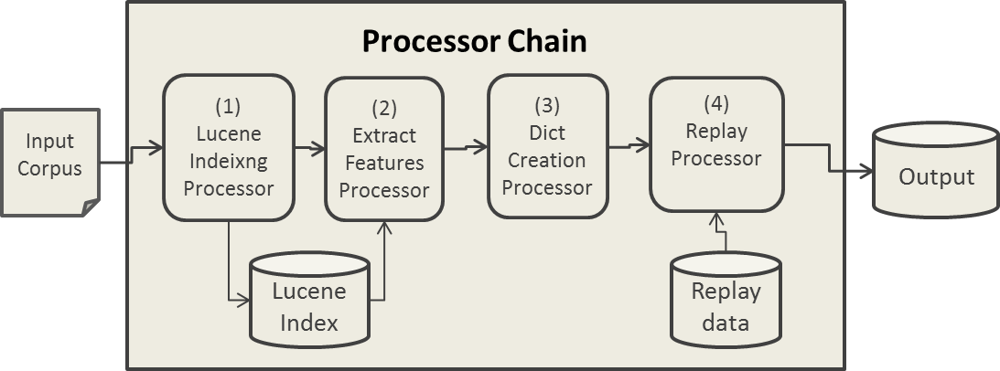

# NLP4L-DICT Dictionary Creation Integration Tool

## Concept

NLP4L provides Dictionary Creation Integration Tool for "Better Search Experience".

Dictionary Creation Integration Tool uses natural language processing (NLP) and machine learning (ML) to process input corpus (language data) and outputs "dictionary".
The "dictionary" is deployed to and referenced by the search engine in order to provide better search experiment.

Dictionary Creation Integration Tool provides GUI for these configurations and executions. Also, an operator can maintain the auto-generated dictionary via GUI because NLP4L is provided based on an assumption that "NLP/ML is not perfect".

## Architecture

Look at the architecture diagram of Dictionary Creation Integration Tool.

### Input
Inputs can be a variety of corpora. In general, it may be some type of text document but a query log may be an input as well.

- Text Document 
  - Glossaries including Wikipedia
  - Variable news corpora (including news feeds and newsgroups)
  - Company documents
  - Company glossaries
- Others
	- Query log (keywords that users input to perform actual searches) 

### Output
Outputs will be variable dictionary data. Document classifications and machine learning models for keyphrase extraction may be outputs as well.

- Dictionary data 
	- Named entities (names of people, locations, organizations, dollar figures, dates, times, etc.)
	- Document classification category 
	- Keyphrases
	- Synonyms 
	- Abbreviations
	- Collocation words
	- Buzzwords
- Machine learning models
	- Document classification models
	- Named entity models 
	- Keyphrase models

### Processor
Dictionary Creation Integration Tool realizes individual processing by the Processors. You can configure it to combine multiple Processors in order to run a series of process as one Job.

In the following diagram, a Processor chain is configured to process input corpora in a series as follows.

1. First, register a corpus to a Lucene index for text analysis.
2. Extract word feature from the index.
3. Make it a dictionary data based on the extracted feature.
4. Reflect the content maintained the last time to the created dictionary. (Replay Process)

### GUI Tool
You can use the GUI tool to configure/run Jobs. You can also maintain the created dictionary data.

- Configuration, Execution
  - Adding/setting JOB
  - Executing/status checking JOB

- Dictionary Data Maintenance 
  - Browsing created dictionary data (JOB execution result)
  - Modifying dictionary data

The following screen shot is Job registration screen of the GUI tool. The detail of Job processing that uses Processor is set in the configuration file and uploaded.

The following screen shot is the maintenance screen for created dictionary data. On this screen, an operator maintains dictionary record (add/update/delete dictionary record) as needed. These manual maintenance operations are recorded on the database. When corpus is updated and a Job is re-run later, maintenance operations performed in the past will automatically be applied (replay function). This way, an operator will not have to perform the same operation again.

A tutorial for these GUI tools is provided in [Getting Started](../getting_started.md). Please actually run it and try it out for yourself.

## Standard Solution

NLP4L provides the followings as standard provided dictionary creation solutions.
These solutions are provided as a pre-implemented built-in Processor.

|Solution|Type|Description|
|:--|:--:|:--|
|Named Entity Extraction|Precision|Extract Named Entity (names of people, locations, organizations, dollar figures, dates, times,etc.)|
|Document Classification|Precision|Classify Text Documents|
|Keyphrase Extraction|Precision|Extract Keyphrases|
|Acronym Extraction|Recall|Extract Acronym|
|Import Query Log|Others|Extract Search Keywords that Users Actually Input|

Refer to [NLP4L-DICT User's Guide](dict_users_guide.md) for these standard provided solutions. 

## User Developed Processor

NLP4L is provided based on an assumption that users will be using the built-in Processors and users will be developing their own as well.

Refer to [Programmer's Guide](dict_programmers_guide.md) for the detail.
