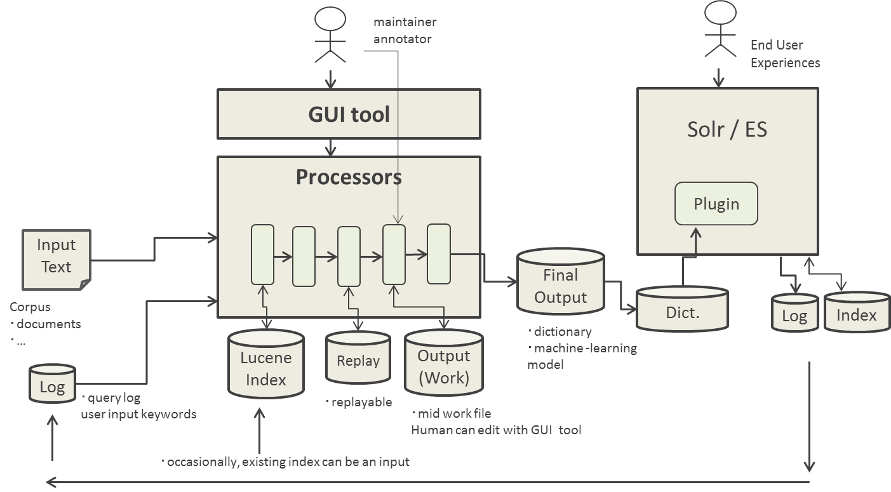
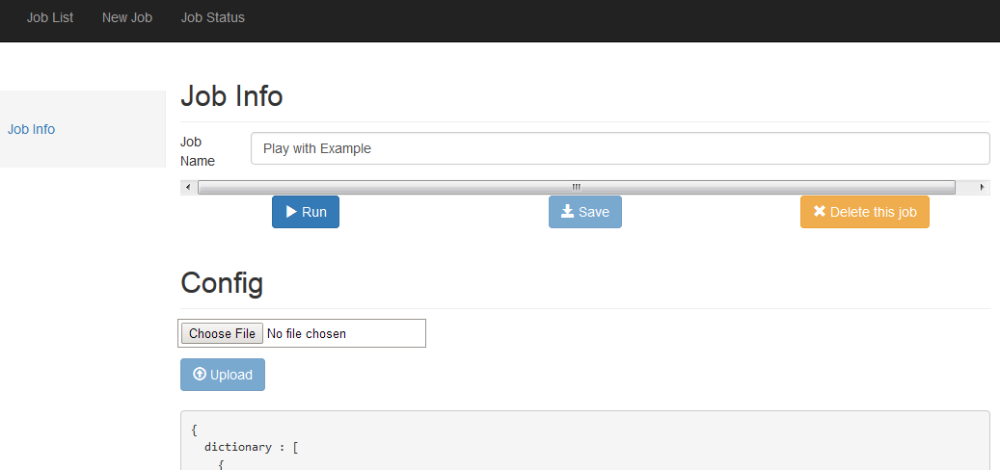

# NLP4L-DICT 辞書生成統合ツール

## コンセプト

NLP4Lでは「検索をよりよいものにする」ために、辞書生成統合ツールを提供しています。

辞書生成統合ツールでは、入力コーパス(言語データ)に対し、自然言語処理(NLP)や機械学習(ML)などを用いて処理を行い、「辞書」を出力します。
「辞書」は検索エンジンへデプロイされてよりよい検索を提供するために参照されます。

辞書生成統合ツールは、これらのコンフィグレーションや実行のためのGUIを提供します。またNLP4Lでは、「NLP/ML は完璧ではない」という前提に立っているため、自動生成した辞書はGUIを通じてオペレーターがメンテナンスできるようになっています。

## アーキテクチャー

辞書生成統合ツールのアーキテクチャ図をご覧ください。

### Input
インプットとなるのは、各種コーパスです。一般的には、何らかのテキスト文書ですが、クエリーログなどもインプットになります。

- テキスト文書
    - ウィキペディアなどの用語解説
    - 各種ニュースコーパス(ニュース配信やnewsgroupなど)
    - 企業内文書
    - 企業内用語集
- その他
	- クエリーログ（実際にユーザが検索を行った際の入力キーワード）

### Output
アウトプットとなるのは、各種の辞書データです。また、文書分類やキーフレーズ抽出のための機械学習モデルを出力することもあります。

- 辞書データ
	- 固有表現(人名、場所、組織、金額、日付、時間など)
	- 文書分類カテゴリ
	- キーフレーズ
	- 類義語
	- 略語
	- 共起語
	- 専門用語
- 機械学習モデル
	- 文書分類モデル
	- 固有表現モデル
	- キーフレーズモデル

### Processor
辞書生成統合ツールでは、個々の処理をProcessorという単位で実現しています。一連の処理を１つのJobとして実行するために、複数のProcessorを組み合わて実行するように、コンフィグレーションすることができます。

下図の例では、インプットとなるコーパスに対して、以下の一連の処理を行う Processor チェインを構成しています。

1. まずテキスト解析用にLuceneのインデックスに登録し、
2. インデックスから単語特徴を抽出し、
3. 抽出した特徴を元に辞書データとして生成し、
4. 生成した辞書に、前回メンテナンスした内容を反映(リプレイ処理)

### GUIツール
GUIツールを使って、Job のコンフィグレーションや実行を行います。また、生成された辞書データをメンテナンスすることもできます。

- コンフィグレーション、実行操作
    - JOBの登録、設定
    - JOBの実行、状況確認

- 辞書データメンテナンス
    - 生成された辞書データ(JOBの実行結果)の閲覧
    - 辞書データの修正

以下のスクリーンショットは、GUIツールのJob登録画面です。Processorを使用したJobの処理内容は、コンフィグレーションファイルに設定し、アップロードします。

以下のスクリーンショットは、生成された辞書データのメンテナンス画面です。この画面を通じて、オペレーターが辞書レコードのメンテナンス（辞書レコードの追加・更新・削除）を必要に応じて行います。人手によるメンテナンスの各種操作は、データベースに記録されます。これにより、後日コーパスが更新されてJobを再実行した際に、過去に行われたメンテナンス作業は自動適用(リプレイ機能)されるため、オペレーターは同じ操作をしなくてもすむようになっています。

これらのGUIツールを使用したチュートリアルが、[Getting Started](../getting_started_ja.md)に用意されています。実際に動かして、試してみてください。

## 標準提供のソリューション

NLP4Lでは、標準提供の辞書生成ソリューションとして、以下のものが提供されています。
これらのソリューションは、予め実装されたビルトインProcessorとして提供されています。

|ソリューション|種別|説明|
|:--|:--:|:--|
|固有表現抽出|精度|固有表現(人名、場所、組織、金額、日付、時間など)を抽出|
|文書分類|精度|テキスト文書を分類|
|キーフレーズ抽出|精度|キーフレーズを抽出|
|頭文字略語抽出|再現率|Acronym(頭文字略語)を抽出|
|クエリログ取込|その他|実際にユーザが入力した検索キーワードを取り出す|

これらの標準提供ソシューションに関しては、 [NLP4L-DICT User's Guide](dict_users_guide_ja.md)を参照してください。

## ユーザ開発のProcessor

NLP4Lでは、ビルトインのProcessorだけでなく、ユーザがProcessorを開発することも想定しています。

詳しくは、[Programmer's Guide](dict_programmers_guide_ja.md)を参照してください。
