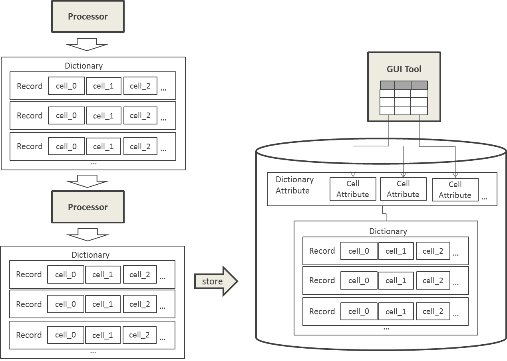

# NLP4L-DICT： Programmer's Guide


## 概要

NLP4Lの辞書生成統合ツールは、ビルトインの標準コンポーネントを利用するだけでなく、ユーザが独自のコンポーネントをプログラム開発することも可能です。

ここでは、開発者向けの情報を提供していきます。


## 開発用ライブラリ

NLP4Lでは、辞書生成統合ツールとしてのライブラリ一式とは別に、開発者用に必要なモジュールを切り出したライブラリを提供しています。

以下の設定例を参考に取得してください。
（以下の例は、ライブラリのバージョンをnlp4l-framework-library_2.11-0.4.0とした場合）

SBTの設定例
```
libraryDependencies += "org.nlp4l" % "nlp4l-framework-library_2.11" % "0.4.0"
```
Ivyの設定例
```
<dependency org="org.nlp4l" name="nlp4l-framework-library_2.11" rev="0.4.0"/>
```
Mavenの設定例
```
<dependency>
    <groupId>org.nlp4l</groupId>
    <artifactId>nlp4l-framework-library_2.11</artifactId>
    <version>0.4.0</version>
</dependency>
```


## API Docs

APIドキュメントが以下にありますので、ご参照ください。

* API Docs：http://nlp4l.github.io/

## データモデル概要

ここでは、辞書生成統合ツールで扱うデータモデルの概要を示します。

- Processorのインプットとアウトプットとなるのは、Dictionaryデータです。
- このDictionaryデータは、複数のRecordを保持することが出来ます。
- さらにRecordは、複数のCellと呼ばれる名前付きホルダーに値を保持することが出来ます。

辞書生成が終了すると、Dictionaryは、データベースに保存され、GUIツールで閲覧・修正可能となります。
このとき利用されるのが、DictionaryAttributeやCellAttributeです。生成されたDictionaryのCellの名前や型などの属性を定義する必要があります。




## ユーザ開発のProcessor

ここでは、ユーザが独自のProcessorを実装する方法について説明します。

### ProcessorFactoryの実装

Processorを使用するには、Processorを生成するFactoryクラスであるProcessorFactoryが必要です。

- ProcessorFactoryを継承したクラスを作成して、getInstance関数を実装。
- Configurationで設定したsettings(Configクラス)が引数として渡されるため、必要に応じてsettingsよりパラメータを取得。
- Processorクラスをインスタンス化。

```
import com.typesafe.config.Config
import org.nlp4l.framework.processors._
import org.nlp4l.framework.models._

class SimpleProcessorFactory(settings: Config) extends ProcessorFactory(settings) {

  override def getInstance: Processor = {
    new SimpleProcessor(getStrParam("param1", "0001"), getIntParam("param2", 2))
  }
}
```

### Processorの実装

次に実際の処理を行うProcessorを実装します（Processorは前述のProcessorFactoryでインスタンス化されます）。

- Processorを継承したクラスを作成して、execute関数を実装。
- execute関数の引数として渡されるDictionaryデータを受け取り、処理を実装。
- 出力Dictionaryデータを生成して、executeメソッドの戻り値として返す。


```
class SimpleProcessor(val param1: String, val param2: Int) extends Processor {

  override def execute(data: Option[Dictionary]): Option[Dictionary] = {
    Thread.sleep(5000)
    val rcrd01 = Record(Seq(Cell("cell01", param1),Cell("cell02", param2),
                            Cell("cell03", 3.1), Cell("cell02_check", null),
                            Cell("cell04", null)))
    val rcrd02 = Record(Seq(Cell("cell01", param1), Cell("cell02", null),
                            Cell("cell03", null), Cell("cell02_check", null),
                            Cell("cell04", null)))
    data match {
      case Some(dic) => {
        val ss = dic.recordList.toBuffer
        ss += rcrd01
        Some(Dictionary(ss))
      }
      case None => {
        val ss = ListBuffer(rcrd01, rcrd02)
        (1 to 20).toList.foreach { n=>
          val rcrd = Record(Seq(Cell("cell01", n.toString()), Cell("cell02", n),
                                Cell("cell03", n.toDouble), Cell("cell02_check", null),
                                Cell("cell04", n.toFloat)))
          ss += rcrd
        }
        val dic = Dictionary(ss)
        Some(dic)
      }
    }
  }
}
```

### Processorのコンフィグレーション

実装したProcessorは、標準のProcessorと同じように、設定ファイルに指定して使用します。

```
  processors : [
    {
      class : org.nlp4l.sample.SimpleProcessorFactory
      settings : {
        param1 : val1
      }
    }
```


## ユーザ開発のDictionaryAttribute

ここでは、ユーザが独自のDictionaryAttributeを実装する方法について説明します。

### DictionaryAttributeの実装


- DictionaryAttributeFactoryを継承したクラスを作成して、getInstance関数を実装。
- Configurationで設定したsettings(Configクラス)が引数として渡されるため、必要に応じてsettingsよりパラメータを取得。
- CellAttribute(Cellの属性)を設定、または独自実装。
- DictionaryAttributeクラスにCellAttributeのリストを渡してインスタンス化。

```
class SimpleDictionaryAttributeFactory(settings: Config) extends DictionaryAttributeFactory(settings) {

  override def getInstance: DictionaryAttribute = {
    
    /**
     * User defined cell hashcode function
     */
    def ignoreThisCell(d: Any): Int = {
      0
    }
    
    /**
     * User defined format function
     */
    class SimpleCellAttribute(name: String, cellType: CellType, isEditable: Boolean, isSortable: Boolean, userDefinedHashCode:(Any) => Int)
      extends CellAttribute(name, cellType, isEditable, isSortable, userDefinedHashCode) {
      override def format(cell: Any): String = {
        "<a href='https://github.com/NLP4L#" + cell.toString() + "'>" + cell.toString() + "</a>"
      }
    }
    val list = Seq[CellAttribute](
      CellAttribute("cell01", CellType.StringType, true, true),
      　　new SimpleCellAttribute("cell02", CellType.IntType, false, true, ignoreThisCell),
      CellAttribute("cell03", CellType.DoubleType, false, true, ignoreThisCell),
      CellAttribute("cell02_check", CellType.StringType, false, false, ignoreThisCell),
      CellAttribute("cell04", CellType.FloatType, false, true, ignoreThisCell)
      )
    new DictionaryAttribute("simple", list)
  }
}
```

### DictionaryAttributeのコンフィグレーション

実装したDictionaryAttributeは、標準のDictionaryAttributeと同じように、設定ファイルに指定して使用します。

```
  dictionary : [
    {
      class : org.nlp4l.sample.SimpleDictionaryAttributeFactory
      settings : {
        param1 : val1
        param2 : val2
        doSome : true
      }
    }
  ]
```


