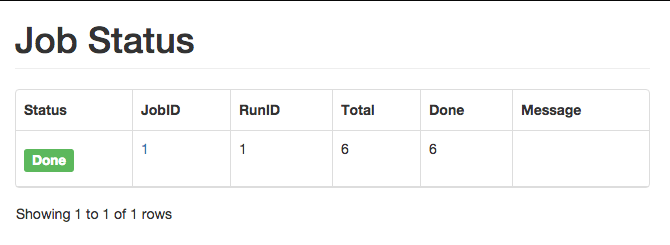
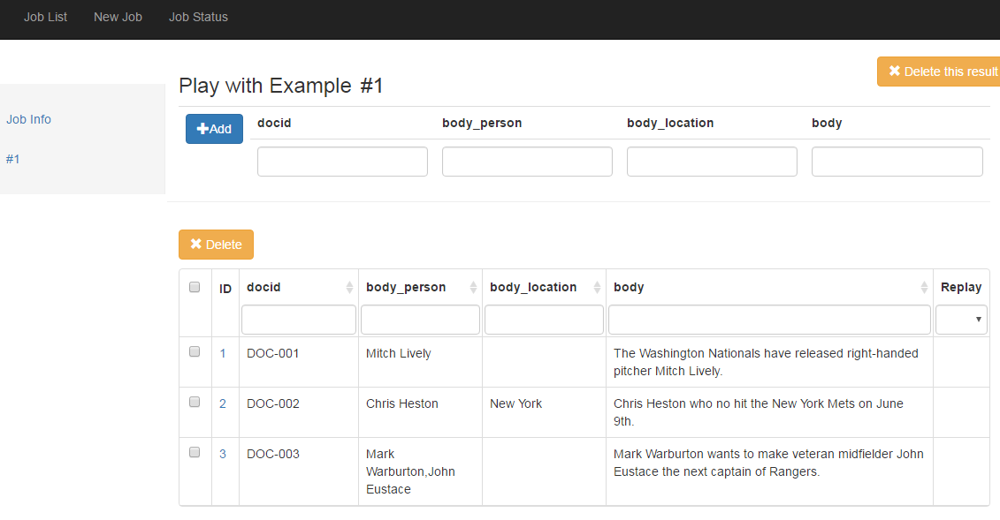

# Getting Started

## ダウンロードとインストール

NLP4L Frameworkの配布用ZIPファイルをダウンロードして、解凍しましょう。


* ダウンロードサイト：https://github.com/NLP4L/framework/releases

```shell
mkdir -p /opt/nlp4l
cd /opt/nlp4l

wget https://github.com/NLP4L/framework/releases/vx.x.x/nlp4l-framework-x.x.x.zip

unzip nlp4l-framework-x.x.x.zip
cd nlp4l-framework-x.x.x

```

## NLP4LのGUIツール

### GUIツールサーバの起動

NLP4L FrameworkのGUIツールサーバを起動します。

* 起動には、Java 1.8以上がインストールされている必要があります。


```shell
bin/nlp4l-framework

```
### GUIツールを使う

ブラウザから [http://localhost:9000/](http://localhost:9000/) にアクセスしてみて下さい。
ブラウザの画面に、Welcomeメッセージが画面表示されます。


## サンプルを試してみる(固有表現抽出)

それでは、固有表現抽出の付属サンプルを動かしてみましょう。

### 固有表現抽出サンプルの概要

NLP4Lの提供する固有表現抽出ソリューションは、自然言語で書かれたテキストから固有表現(人名、場所、組織、金額、日付、時間など)を切り出す機能を提供します。

固有表現の抽出には、[Apache OpenNLP (http://opennlp.apache.org/)](http://opennlp.apache.org/)で提供されているName Finderの学習済みモデルを使用することにより、実現されています。

このサンプルでは、文書ID(docID)とテキスト(body)をCSVデータとして入力し、テキスト(body)から、人名(Person)と場所(Location)を抽出する処理を行うサンプルとなっています。


### OpenNLPモデルファイルのダウンロード

NLP4Lの固有表現抽出では、[Apache OpenNLP (http://opennlp.apache.org/)](http://opennlp.apache.org/)で提供されている学習済みモデルを使用します。これらの学習済みモデルはSourceforgeのサイトよりダウンロードできます。

* OpenNLPの学習済みモデルのダウンロードサイト：http://opennlp.sourceforge.net/models-1.5/

NLP4Lの固有表現抽出では、SentenceとTokenの切り出しに、それぞれの学習済みモデルを使用します。サンプルデータのテキスト文書は英語で記述されていますので、Languageはenのモデルをダウンロードしておきます。

* Sentence Detector (en)：http://opennlp.sourceforge.net/models-1.5/en-sent.bin
* Tokenizer (en)：http://opennlp.sourceforge.net/models-1.5/en-token.bin

さらに、サンプルでは、人名(Person)と場所(Location)を抽出しますので、それぞれの学習済みモデルもダウンロードしておきます。

* Name Finder Person (en): http://opennlp.sourceforge.net/models-1.5/en-ner-person.bin
* Name Finder Location (en): http://opennlp.sourceforge.net/models-1.5/en-ner-location.bin

ダウンロードしたファイルは、/opt/nlp4l/example-ner/models ディレクトリに配置しておくと、サンプルのコンフィグレーション(後述)を修正することなく使用できるので便利です。

```
mkdir -p /opt/nlp4l/example-ner/models
cd /opt/nlp4l/example-ner/models

wget http://opennlp.sourceforge.net/models-1.5/en-sent.bin
wget http://opennlp.sourceforge.net/models-1.5/en-token.bin
wget http://opennlp.sourceforge.net/models-1.5/en-ner-person.bin
wget http://opennlp.sourceforge.net/models-1.5/en-ner-location.bin

```

これでモデルの準備は整いました。それでは、実際にGUI Toolを用いて、固有表現抽出を動かしてみましょう。


### 新規Jobの登録

1 . [New Job](http://localhost:9000/dashboard/job/new) ボタンを押下してください。Jobの登録画面が表示されます。


2 .Configファイルをアップロードします。
サンプルとして提供されている examples/example-opennlp-ner.confを指定して、Uploadボタンを押下してください。
このConfigファイルには、先の概要の図で説明した通り、CSVデータを読み込み(サンプルの英文データはConfigファイル内に埋め込まれています)、学習済みモデルを使用して固有表現を抽出し、テーブル形式のデータ(Dictionaryと呼ばれます)として保存する処理が定義されています。保存した結果は、後述の画面で参照していきます。


```
{
  dictionary : [
    {
      class : org.nlp4l.framework.builtin.GenericDictionaryAttributeFactory
      settings : {
        name: "OpenNLPNerDict"
        attributes : [
          { name: "docId" },
          { name: "body_person" },
          { name: "body_location" },
          { name: "body" }
        ]
      }
    }
  ]

  processors : [
    {
      class : org.nlp4l.sample.SampleCsvDataProcessorFactory
      settings : {
        fields: [
          "docId",
          "body"
        ],
        data: [
          "DOC-001, The Washington Nationals have released right-handed pitcher Mitch Lively."
          "DOC-002, Chris Heston who no hit the New York Mets on June 9th."
          "DOC-003, Mark Warburton wants to make veteran midfielder John Eustace the next captain of Rangers."
        ]
      }
    }
    {
      class : org.nlp4l.framework.processors.WrapProcessor
      recordProcessors : [
        {
          class : org.nlp4l.framework.builtin.ner.OpenNLPNerRecordProcessorFactory
          settings : {
            sentModel:  "/opt/nlp4l/example-ner/models/en-sent.bin"
            tokenModel: "/opt/nlp4l/example-ner/models/en-token.bin"
            nerModels: [
              "/opt/nlp4l/example-ner/models/en-ner-person.bin",
              "/opt/nlp4l/example-ner/models/en-ner-location.bin"
              ]
            nerTypes: [
              "person",
              "location"
            ]
            srcFields: [
              "body"
            ]
            idField:    "docId"
            passThruFields: [
              "body"
            ]
            separator:  ","
          }
        }
      ]
    }
    {
      class : org.nlp4l.framework.builtin.ReplayProcessorFactory
      settings : {
      }
    }
  ]
}

```

3 . Job Name テキストボックスに、ジョブの名前を入力し、Saveボタンを押下してください。
これで新規Jobの登録が完了です。


### Jobの実行

Jobの登録が完了すると、Runボタンが表示されます。Runボタンを押下して、Jobを実行してみましょう。
実行したJobは、[Job Status](http://localhost:9000/dashboard/job/status)画面で見ることができます。


Jobの実行中は、StatusがRunningと表示されます。
Jobの実行が終了すると、StatusがDoneと表示され、結果を見ることが出来ます。




### Jobの結果

Jobの実行結果は、(1) Job Status画面のから該当JobのJobIDをクリックする、または、(2) Job Info画面左側に表示されているJobID（#1）をクリックすることで、該当Jobの結果画面に遷移します。

下図の結果画面に示すとおり、固有表現（ここでは人名と場所）が抽出されていることがわかります。




