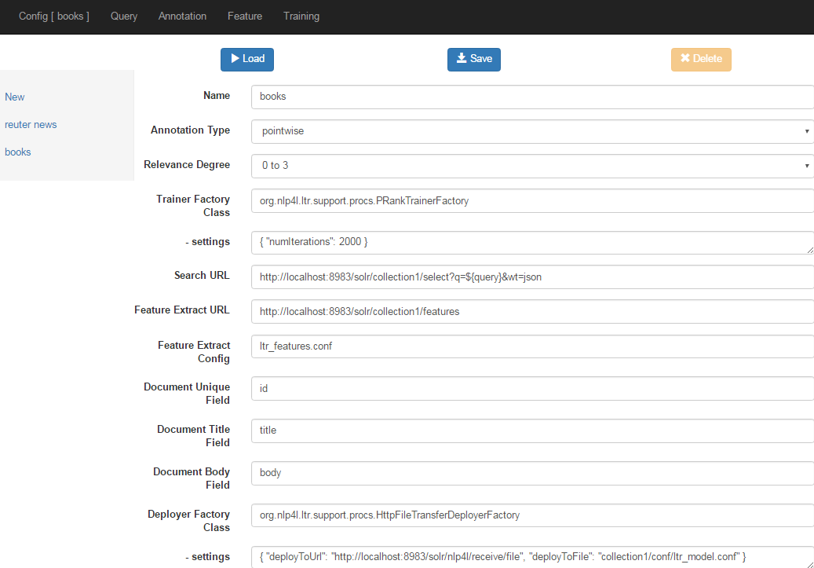
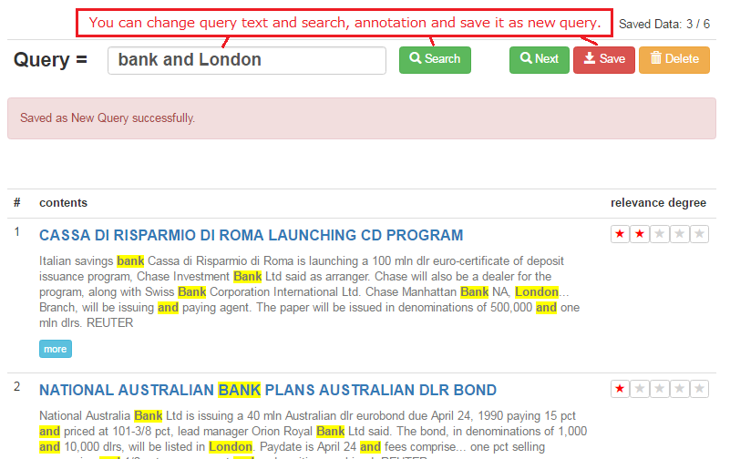

# NLP4L-LTR： GUIツール利用ガイド

ここでは、NLP4Lのランキング学習ツールで提供されているGUIツールの利用方法、および、各画面の操作を説明します。

GUIツールは、5つのメニューからなります。

|menu|description|
|:--|:--|
|Config|ランキング学習モデルの種類や、検索サーバ(Solr/Elasticsearch)のURL指定などの各種設定を行います。<br>複数の設定を保持することができ、指定(Load)した設定に従ってQuery/Annotation/Feature/Trainingが動作します。|
|Query|クエリ文字列の一覧管理を行います。<br>Annotationで使用するクエリの一覧が表示されます。クエリ文字列を記述したファイルをアップロードして登録したり、不要なクエリの削除なども可能です。<br>また、実アプリケーションでユーザが検索してクリックしたログを分析して、アノテーション付きクエリデータとして、インポートすることも出来ます。|
|Annotation|検索サーバ(Solr/Elasticsearch)に対してクエリ文字列を使って検索を実行し、検索結果一覧を表示します。Annotatorは各文書に星マークを付与することでクエリに対する文書の関連度を評価します。|
|Feature|アノテーション付けされた文書のクエリに対する特徴抽出を行います。<br>特徴抽出は検索サーバ(Solr/Elasticsearch)側で行われるため、選択可能な特徴がその名称とともにサーバ側にて事前に設定されている必要があります。|
|Training|ランキング学習を実行し、モデルファイルを生成します。生成されたモデルファイルを、サーバにデプロイすることも出来ます。|

各画面の上部に表示されているのが、メニューです。


以下、それぞれのメニュー毎に詳細を説明します。

## Config画面

Config画面では、学習モデルの種類、関連度合のレベルや、検索サーバ(Solr/Elasticsearch)のURL指定など、各種設定を行います。



具体的な設定項目は、以下の通りです。

|設定項目|説明|
|:--|:--|
|Name|コンフィグレーションの名前。<br>複数のコンフィグ設定が保持できるため、名前で識別できるようにしておく。|
|Annotation Type|pointwise / pairwise / listwise。（現時点では pointwiseのみサポート）|
|Relevance Degree|ランク付けの関連度合レベルの設定。1～5までの5段階より選択。<br>ここで設定した値に従い、Annotation画面のランク付けで最大表示される星マークの数が決まる。|
|Trainer Factory Class|ランキング学習のFactoryClassを指定する。<br>例: org.nlp4l.ltr.support.procs.PRankTrainerFactory|
|- settings|上記のTrainer Factory Classに引き渡される設定。<br>例: { "numIterations": 2000 }|
|Search URL|検索サーバ(Solr/Elasticsearch)のURL。（現時点では Solrのみサポート）<br>${query}の箇所がクエリ文字列に置き換えられて検索サーバへリクエストが送られる。<br>JSON形式で検索結果を受け取ることを想定しているため、wt=jsonを付加する必要がある。<br>ハイライトなどの指定も可能。<br>例: http://localhost:8983/solr/collection1/select?q=${query}&wt=json|
|Feature Extract URL|Feature抽出用の検索サーバ(Solr/Elasticsearch)のURL。（現時点では Solrのみサポート）<br>サーバ側でFeature抽出用の設定が必要。<br>例: http://localhost:8983/solr/collection1/features|
|Feature Extract Config|Feature抽出時に検索サーバ側で使用するコンフィグファイル名。<br>例: ltr_features.conf|
|Document Unique Field|文書のユニークフィールドの名前。<br>例: id|
|Document Title Field|文書のTitleフィールドの名前。<br>例: title|
|Document Body Field|文書のBodyフィールドの名前。<br>例: body|
|Deployer Factory Class|生成したモデルのデプロイを行うFactoryClassを指定する。<br>例: org.nlp4l.ltr.support.procs.HttpFileTransferDeployerFactory|
|- settings|Deployer Factory Classに引き渡される設定。<br>例:<br>{ "deployToUrl": "http://localhost:8983/solr/nlp4l/receive/file", <br>  "deployToFile": "collection1/conf/ltr_model.conf" }|

#### 新規作成(New)

画面左のサイドバーのNewリンクをクリックすると、Configの新規登録が出来ます。

各フィールドを設定後、Saveボタンをクリックすると、新規登録されます。

（新規登録した設定を使用して、Query/Annotation/Feature/Trainingを行うためには、保存(Save)後にLoadボタンをクリックする必要がありますので、ご注意ください。）

#### 変更・削除

画面左のサイドバーに表示されたコンフィグの一覧から、変更したいコンフィグのリンクをクリックします。設定を編集後、Saveボタンをクリックすることで、設定が変更されます。

また、Deleteボタンをクリックすると、削除できます。(削除対象のConfigがLoadされている状態の時は削除できません。一旦他のConfigをLoadしてから、削除対象のConfigを選択して削除してください。)

#### Configの切り替え

複数のConfigを設定し、切り替えて使用できます。

Configの切り替えは、画面左のサイドバーに表示されたConfigの一覧から、使用したいConfigのリンクをクリックして選択し、Loadボタンをクリックすることで切り替わります。現在使用中のConfigの名前が、画面上部メニューのConfigの横に表示されます。

ランキング学習（Query/Annotation/Feature/Training）は、現在使用中の(Loadした)Configの設定に従い、動作します。


## Query画面

Query画面では、クエリ文字列の一覧を管理します。

この画面では、Annotationで使用するクエリ文字列の一覧が表示されます。アノテーション済みのクエリ文字列は、Annotation Status欄がdoneと表示されます。

クエリ文字列のリンクをクリックすると、Annotation画面に遷移します。


#### クエリ文字列ファイルのアップロード
クエリ文字列の一覧を新規登録するには、1つのクエリ文字列が1行に記載されたテキストファイルをファイル選択ボタンで選択した後、アップロードボタンをクリックします。

既存のクエリリストが存在する場合、アップロード登録は既存データの後ろに追加挿入されます。

クエリ文字列一覧ファイルの例を以下に示します。

```
bank
London
computer
bank AND America
title:London
:
```

#### クエリの削除とクリア

クエリを削除するには、対象となるクエリのチェックボックスを選択し、テーブル左上のDeleteボタンをクリックします。

アノテーション済みクエリに対して、Annotationデータをクリアするには、対象となるクエリのチェックボックスを選択し、テーブル左上のClearボタンをクリックします。また、全てのクエリのAnnotationデータをクリアしたい場合には、画面右上のClear Allボタンをクリックします。

#### インポート

外部からデータをインポートする場合には、Importボタンをクリックします。Importボタンをクリックすると、Data Import用の画面に遷移します。


インポート機能に関しては、[クリックログ分析とインポート](ltr_import_ja.md)を参照してください。


## Annotation画面

Annotation画面では、検索サーバ(Solr/Elasticsearch)に対して、クエリ文字列による検索を実行し、検索結果の文書一覧に対して、人手でアノテーション付けを行います。

#### アノテーション付けと保存(Save)
アノテーション付けは検索結果一覧の各文書に対して、星マークを付与することで行います。

Annotation画面にて、検索結果一覧の各文書を読み、クエリに対する関連度合いを判断し、relevance degree欄の星マークを適切にセットします。ランキング上位に来て欲しい文書ほど多くの星マークを付与するようにします。

１つのクエリ文字列に対し一通りのアノテーション付け（星マーク付与）が済んだら、Saveボタンをクリックして、Annotationデータを保存します。（星マークを付けただけではデータ保存されませんので、Saveボタンのクリックを忘れないでください。）


#### ハイライト表示

検索結果一覧のタイトルと本文欄に、ハイライト表示することも可能です。

ハイライト表示をするには、検索サーバ(この例ではSolr)からハイライト情報を返してもらう必要があるため、ConfigのSearch URLの指定で行います。

以下の例では、ハイライトを黄色背景表示させるSearch URLの例です。（Search URLのQueryパラメータの指定に関しては、Solrのマニュアルを参照してください。）

```
http://localhost:8983/solr/collection1/select?q=${query}&wt=json&hl=true&hl.fl=title,body&hl.simple.pre=<b style='background:yellow'>&hl.simple.post=</b>&hl.snippets=3&hl.fragsize=300
```

この設定を行うことにより、以下のようなAnnotation画面が表示されます。


#### 詳細表示(moreボタン)
検索結果一覧に表示されるのは、タイトルと本文の一部ですが、さらに詳細を見たい場合があるでしょう。
その場合は、moreボタン（またはタイトルのリンク）をクリックすると、詳細ダイアログがポップアップして、全てのフィールドの値が参照できます。

ポップアップしたダイアログ側でも、アノテーション付け(星マーク付与)を行うことが出来ます。


#### クエリ文字列入力欄と検索(Searchボタン)

事前に登録したクエリ文字列で検索した結果、さらに、クエリ文字列に追加変更を加えて、評価したい場合があります。このような場合、クエリ文字列入力欄の文字列を修正し、Searchボタンをクリックすることで、修正したクエリ文字列の検索結果に対して、アノテーション付けを行うことが出来ます。

例えば、事前に「bank」というクエリ文字列を登録して検索を行った結果、学習に使用するのに相応しくないクエリ文字列だということであれば、例えば「bank AND London」とクエリ文字列を変更して、Searchボタンをクリックし、その検索結果に対してアノテーション付けを行い、Saveボタンをクリックします。

新しいクエリ文字列(「bank AND London」)は、クエリ一覧の最後に自動的に追加されます。（元のクエリ文字列の書き換えが行われる訳ではありません。）



Query画面で見ると、最後に新しいクエリ文字列が追加されていることが確認できます。


このクエリ文字列入力欄とSearch、Saveボタンの機能を利用することにより、事前にクエリ文字列を準備していなくても、自由にクエリ文字列を指定して検索し、アノテーション付けを行いながら、クエリ文字列登録を行うことが可能です。

#### 次のQueryへ(Nextボタン)

Nextボタンをクリックした場合、クエリ一覧の中で、現在のクエリ文字列より後ろの、まだアノテーション付けがすんでいない次のクエリ文字列が自動選択されて検索されます。

後ろにアノテーション済みでないクエリ文字列がない場合、「No queries.」と表示されます。

#### Menuバーからの遷移した場合
画面上部のMenuバーの「Annotation」リンクから遷移した場合、まだアノテーションがすんでいない先頭のクエリ文字列が自動選択されて検索されます。

#### クエリ文字列の削除(Deleteボタン)

Deleteボタンをクリックすると、アノテーションデータがクリアされるだけでなく、クエリ一覧からも削除されます。
例えば、実際にクエリ文字列を検索して検索結果を見たときに、学習には相応しくないクエリ文字列だと判断した場合などに利用します。

## Feature画面

Features画面では、アノテーション付けした文書の各クエリに対する特徴の抽出を行います。

特徴抽出は検索サーバ(Solr/Elasticsearch)側で行われるため、抽出する特徴がその名称とともにサーバ側にて事前に設定されている必要があります。

ここではサーバ側の記載は省略します。サーバ側の設定に関しては、[NLP4Lのsolrプロジェクト](https://github.com/NLP4L/solr)の設定を参照してください。

#### 特徴の抽出

Extractボタンをクリックすることにより、特徴抽出が始まります。


Extraction StatusがDONEになれば、抽出完了です。


再度特徴抽出する場合には、Clearしてから、Extractを行うようにして下さい。


## Training画面

Training画面では、Query Annotation Dataを使ってランキング学習トレーニングを行い、モデルを生成します。

#### 新規トレーニングとモデル生成

新規にトレーニングを実行してモデル生成を行うには、まず、画面左側のサイドバーのNewリンクをクリックして、新規作成画面を表示します。

Featuresには、事前に特徴抽出しておいた特徴一覧が表示されます。

ここで、使用する特徴をチェックボックスのチェックで選択し、Startボタンをクリックすると、トレーニングを開始します。

トレーニングとモデル生成は、Configで設定したTrainer Factory Classが生成したTrainerが行います。


トレーニングが終了し、モデルが生成されると、生成されたモデルデータを見ることが出来ます。


#### モデルファイルのデプロイ

生成したモデルファイルをデプロイするには、Deployボタンをクリックします。デプロイは、Configで設定したDeployer Factory Classが生成したDeployerが行います。

デプロイが成功すると、Successと表示されます。


#### モデルの削除

Deleteボタンをクリックすると、生成したモデルが削除されます。


