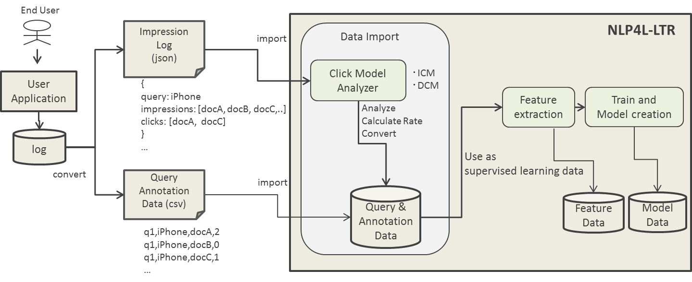
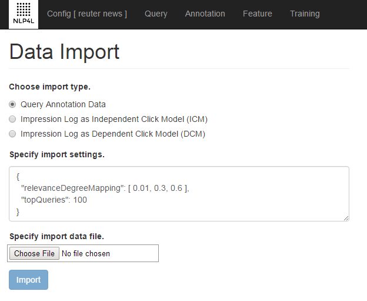
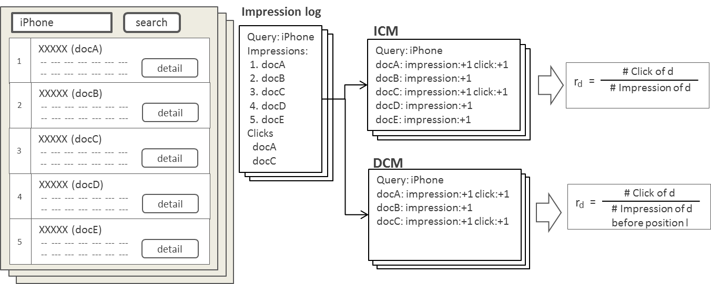

# NLP4L-LTR: Click Log and Import 

NLP4L-LTR provides a function to analyze logs of searches and clicks in an actual application by users, convert it to Annotation data that can be used as training data of learning-to-rank, and import it in the system.



In order to use the import function, you need to covert a click log, which you acquired on the search application-side, into the import format for NLP4L-LTR . The following 2 formats are supported as the import formats.

- Impression Log (JSON format)
	- Impression log includes searched query character string, list of documents displayed by them, and clicked documents.
	- Probabilities are calculated by click models and are converted to annotation data for import.
	- Independent Click Model(ICM) and Dependent Click Model(DCM) are supported as the click models.

- Query Annotation Data(CSV)
	- Click logs are analyzed on the application-side and the data already converted to annotation data is imported.


Details of each log data format are described in the following.

## Screen Operation

This section describes the screen operations of the import function.

To use the import function, set up (or Load if there is already a setting) the Config to import and click the Import button on the Query screen.


Clicking the Import button will send you to the screen for import.



Select an import type on the import screen, set parameters in the import settings, select a data file to import, and click the Import button.

- Query Annotation Data
	- Select when importing Query Annotation Data(CSV).
	- Import settings are not required. (Import settings are ignored.)

- Impression Log as Independent Click Model (ICM)
	- Select when impression log (JSON format) is imported.
	- The impression log goes through click log analysis as ICM and will be imported.

	- The following import settings are required.

- Impression Log as Dependent Click Model (DCM)
	- Select when impression log (JSON format) is imported.
	- The impression log goes through click log analysis as DCM and will be imported.
	- The following import settings are required.

Clicking the Import button will display the import results in the area bellow the button.


Imported Query can be checked on the Query screen.
Annotation Status is "done" as they are already annotated.


## Importing Impression Log

### Impression Log Click Model Analysis

When you specify impression log, click models are calculated, converted to annotation data, and imported to the system.

Currently, click models for Independent Click Model (ICM) and Dependent Click Model (DCM) are supported.

- Independent Click Model (ICM)

	- Calculate the number of impressions (displays) and the number of clicks on the document for each query character string.
	- Regardless of the position of impression, simply dive the number of clicks for the target document by the number of impressions to calculate the click probability.

- Dependent Click Model (DCM)
	- DCM takes into account the impression position, exclude the impressions lower than the documents at last clicked position, calculates the number of impressions and click probability.
	- Note that if no document was clicked, the documents will be included into the impression total.



The Relevance Degree calculated as a click probability will be converted into the annotation data of Pointwise by relevanceDegreeMapping specified in the import settings and imported into the system.


### Impression Log Format 

Impression log is in the JSON format as follows.

|name|description|
|:--|:--|
|query|Query character strings used for search|
|impressions|Array of impression (displayed) document ID<br>Array is in the order of rankings of positions displayed higher|
|clicks|Array of clicked document IDs<br>Elements are in the ad hoc order and are not necessarily in the order of clicks.<br>Document IDs can be redundant in the cases where there is more than one click.

Refer to the following impression log as a sample.
```
{
 "data": [
  {
   "query": "iPhone",
   "impressions": [ "docA", "docB", "docC", "docD", "docE" ],
   "clicks": [ "docA", "docC" ]
  },
  {
   "query": "iPhone",
   "impressions": [ "docA", "docB", "docC", "docD", "docE" ],
   "clicks": [ "docA" ]
  },
  {
   "query": "Android",
   "impressions": [ "docA", "docB", "docC", "docD", "docE" ],
   "clicks": [ "docD", "docC", "docD" ]
  },
  {
   "query": "Android",
   "impressions": [ "docA", "docB", "docC", "docD", "docE" ],
   "clicks": [ "docA" ]
  },
  {
   "query": "Android",
   "impressions": [ "docA", "docB", "docC", "docD", "docE" ],
   "clicks": []
  }
 ]
}

```

### Import Settings for Impression Log

Available settings for impression log are as follows.

|name|required|description|
|:--|:--:|:--|
|relevanceDegreeMapping|true|Boundary value that is referenced for mapping Relevance Degree that is calculated as click probability to Pointwise data during Pointwise to annotation data conversion. <br>Ex: [ 0.01, 0.3, 0.6 ]<br>The conversion is done in the following order for the above example. <br>(1) Convert to 0 when Relevance Degree < 0.01. <br>(2) Convert to 1 when Relevance Degree < 0.3. <br>(3) Convert to 2 when Relevance Degree < 0.6. <br>(4) Convert to 3 when Relevance Degree >= 0.6.|
|topQueries|false|Specify when importing the top N queries that involves more number of searches than others. The default is importing all queries.


## Importing Query Annotation Data 

### Formating Query Annotation Data 

Query Annotation Data is in the CSV format as follows.

|Column|Description|
|:--|:--|
|Column 1| Unique ID for each query.<br>Strictly for binding more than one line for CSV data. A new QueryID will be given again and inserted into DB during the internal import process.|
|Column 2|Query character string used for search.|
|Column 3|Document ID|
|Column 4|Relevance Degree (Relevance Degree) value for Pointwise|
Column 5 and the followings will be ignored if exist.

Refer to the following samples.

```
1,iPhone,docA,2
1,iPhone,docB,0
1,iPhone,docC,1
1,iPhone,docD,0
1,iPhone,docE,0
2,Android,docA,1
2,Android,docB,0
2,Android,docC,1
2,Android,docD,2
2,Android,docE,0


```
