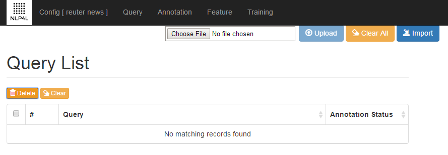
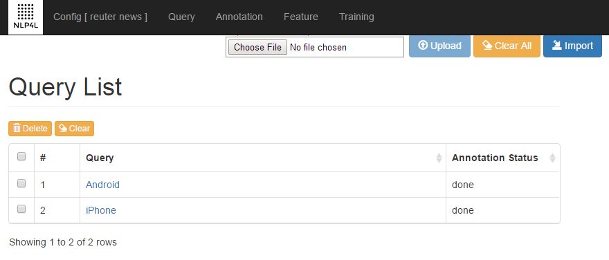

# NLP4L-LTR： クリックログ分析とインポート

## 概要

NLP4L-LTR では、実アプリケーションで実際にユーザが検索してクリックしたログを分析し、ランキング学習の教師データとして使用可能なAnnotationデータに変換して、インポートする機能を提供しています。


インポート機能を利用するには、検索アプリケーション側で取得したクリックログをNLP4L-LTRのインポート用フォーマットに変換する必要があります。インポートフォーマットは、以下の2つの形式がサポートされています。

- インプレッションログ(JSON形式)
	- インプレッションログには、クエリー文字列、表示した文書一覧、クリックされた文書が含まれます。
	- クリックモデル分析を行い、クリック率が計算され、アノテーションデータに変換されてインポートされます。
	- クリックモデル分析には、Independent Click Model(ICM)とDependent Click Model(DCM)がサポートされています。

- Query Annotation Data(CSV)
	- アプリケーション側でクリックログ分析を行い、アノテーションデータに変換済みのデータをインポートすることを想定しています。


各ログフォーマットの詳細は、後述を参照してください。

## 画面操作

ここではインポート機能の画面操作について説明します。

インポート機能を利用するには、まず、インポート対象のConfigを設定(既に設定がある場合は、Load)し、Query画面の「Import」ボタンを押下します。



「Import」ボタンを押下すると、インポート用の画面に遷移します。


インポート画面では、インポートのtypeを選択し、import settingsでパラメータ設定を行い、インポートするデータファイルを選択して、「Import」ボタンを押下します。

- Query Annotation Data
	- Query Annotation Data(CSV)をインポートする場合に選択します。
	- import settingsは不要です。(import settingsは、無視されます)

- Impression Log as Independent Click Model (ICM)
	- インプレッションログ(JSON形式)をインポートする場合に選択します。
	- インプレッションログは、ICMとしてクリックログ分析され、インポートされます。
	- import settingsが必要です。(後述参照)

- Impression Log as Dependent Click Model (DCM)
	- インプレッションログ(JSON形式)をインポートする場合に選択します。
	- インプレッションログは、DCMとしてクリックログ分析され、インポートされます。
	- import settingsが必要です。(後述参照)

「Import」ボタンを押下すると、インポート結果が、ボタン下のエリアに表示されます。


インポートされたQueryは、Query画面より確認できます。
アノテーション済みであるため、Annotation Statusは、doneとなっています。




## インプレッションログのインポート

### インプレッションログのクリックモデル分析

インプレッションログを指定すると、クリックモデル分析され、アノテーションデータに変換されて、インポートされます。

クリックモデルでは、現在、Independent Click Model(ICM)とDependent Click Model(DCM)がサポートされています。

- Independent Click Model (ICM)

	- クエリー文字列毎に、インプレッション(表示)した文書とクリックされた文書の回数を集計します。
	- インプレッションしたポジションに関係なく、単純に該当文書のクリック数をインプレッション数で割り算して、クリック率を求めます。

- Dependent Click Model (DCM)
	- DCMでは、インプレッションしたポジションを考慮し、最後にクリックされたポジションの文書より下位のインプレッションは除外して、インプレッション回数を集計し、クリック率を求めます。
	- なお、いずれの文書もクリックされなかった場合は、それらの文書はインプレッションの集計に含まれます。


計算されたクリック率は、import settingで指定したrelevanceDegreeMappingにより、文書関連度の数値に変換され、アノテーションデータとして、インポートされます。


### インプレッションログのフォーマット

インプレッションログのフォーマットは、JSON形式で、以下の通りです。

|name|description|
|:--|:--|
|query|検索に使用されたクエリー文字列。|
|impressions|インプレッション(表示)した文書IDの配列。<br>配列の並び順は、上位表示したポジションのランク順。|
|clicks|クリックされた文書IDの配列。<br>配列の並び順は、特に関係なく、クリックされた順である必要はない。<br>2回以上クリックされた場合など、文書IDが重複することも可能。|

以下のインプレッションログのサンプルを参考にしてください。
```
{
 "data": [
   {
     "query": "iPhone",
     "impressions": [ "docA", "docB", "docC", "docD", "docE" ],
     "clicks": [ "docA", "docC" ]
   },
   {
     "query": "iPhone",
     "impressions": [ "docA", "docB", "docC", "docD", "docE" ],
     "clicks": [ "docA" ]
   },
   {
     "query": "Android",
     "impressions": [ "docA", "docB", "docC", "docD", "docE" ],
     "clicks": [ "docD", "docC", "docD" ]
   },
   {
     "query": "Android",
     "impressions": [ "docA", "docB", "docC", "docD", "docE" ],
     "clicks": [ "docA" ]
   },
   {
     "query": "Android",
     "impressions": [ "docA", "docB", "docC", "docD", "docE" ],
     "clicks": []
   }
 ]
}

```

### インプレッションログのimport settings

インプレッションログのインポートで設定可能なsettingsは、以下の通りです。

|name|required|description|
|:--|:--:|:--|
|relevanceDegreeMapping|true|アノテーションデータへの変換時に、文書関連度(Relevance Degree)へのマッピングに使用される。クリック率の境界範囲値を指定。<br>例： [ 0.01, 0.3, 0.6 ]<br>例の場合、以下の順で変換される。<br>(1) クリック率 < 0.01 の場合、文書関連度は、0に変換。<br>(2) クリック率 < 0.3 の場合、文書関連度は、1に変換。<br>(3) クリック率 < 0.6 の場合、文書関連度は、2に変換。<br>(4) クリック率 >= 0.6 の場合、文書関連度は、3に変換。|
|topQueries|false|検索回数の多い上位N件のクエリのみをインポートする場合に指定。省略時は、全クエリーがインポート対象となる。|


## Query Annotation Dataのインポート

### Query Annotation Dataのフォーマット

Query Annotation Dataのフォーマットは、CSV形式で、以下の通りです。

|colum|description|
|:--|:--|
|1列目|クエリー毎にユニークに採番された識別子。<br>あくまでCSVデータの複数行を括るために使用されるもので、インポートの内部処理ではQueryIDが採番し直されてDBにinsertされる。|
|2列目|検索に使用されたクエリー文字列。|
|3列目|文書ID。|
|4列目|文書関連度(Relevance Degree)の数値。|
5列目以降が存在する場合、無視されます。

以下のサンプルを参考にしてください。

```
1,iPhone,docA,2
1,iPhone,docB,0
1,iPhone,docC,1
1,iPhone,docD,0
1,iPhone,docE,0
2,Android,docA,1
2,Android,docB,0
2,Android,docC,1
2,Android,docD,2
2,Android,docE,0


```
