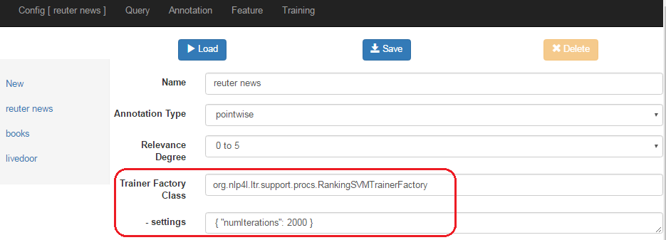

# NLP4L-LTR: RankingSVM Model 

## Overview

NLP4L-LTR provides a RankingSVM learning-to-rank program, which has been implemented using SVM(Support Vector Machine) algorithm as one of Pairwise approaches. MLlib provided by [Apache Spark (http://spark.apache.org/)](http://spark.apache.org/) is used for SVM learning.

RankingSVM learning-to-rank is performed based on the Feature data and training data, created/extracted using NLP4L-LTR, in order to create model data. Note that the RankingSVM program of NLP4L-LTR artificially creates Pairwise data from Pointwise data to perform the process.


## Config
Set the Config as follows to use the RankingSVM model.




### Trainer Factory Class Setting

Specify org.nlp4l.ltr.support.procs.RankingSVMTrainerFactory as Trainer Factory Class.

### settings

Settings available for the RankingSVM model are as follows.

|name|required|default|description|
|:--|:--:|:--:|:--|
|numIterations|false|2000|number of times training is repeated|

## Model Data 
The RankingSVM model data will be output in the JSON format as follows.

This includes weight of each Feature.


```
{
 "model" : {
  "name" : "linearWeight",
  "type" : "linearWeight",
  "weights" : [{
   "name" : "TF in title",
   "weight" : 0.16256159599933862
  }, {
   "name" : "TF in body",
   "weight" : 0.4760258564550035
  }]
 }
}
```
