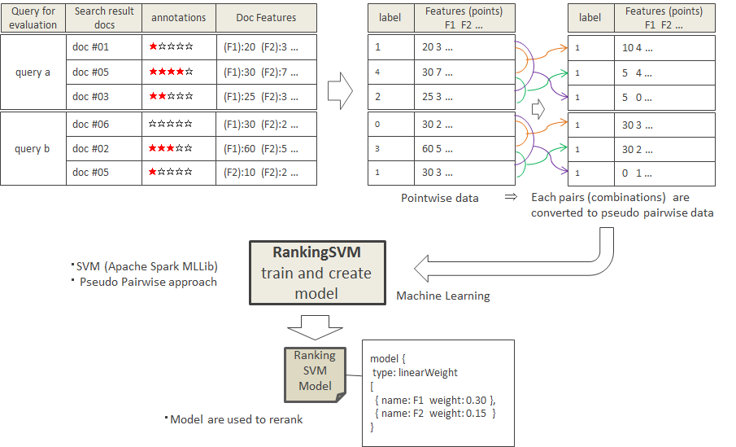

# NLP4L-LTR： RankingSVMモデル

## 概要

ランキング学習支援ツールでは、予め実装されたビルトインの学習モデルの1つとして、RankingSVMモデルが提供されています。

RankingSVMモデルは、SVM(support vector machine)を用いたモデルです。SVMには、[Apache Spark (http://spark.apache.org/)](http://spark.apache.org/)で提供されているMachine Learning Library (MLlib)が使用されています。

また、RankingSVMモデルでは、Pointwiseデータから疑似的にpairwiseデータに変換して処理を行います。

ランキング学習支援ツールを使用して、作成・抽出したAnnotationデータとFeatureデータを元に、機械学習トレーニングを実行し、モデルデータを生成します。




## Config
RankingSVMモデルを使用するには、Configに、以下のように設定します。


### Trainer Factory Class設定

Trainer Factory Classには、org.nlp4l.ltr.support.procs.RankingSVMTrainerFactoryと指定します。

### settings設定

RankingSVMモデルで設定可能なsettingsは、以下の通りです。

|name|required|default|description|
|:--|:--:|:--:|:--|
|numIterations|false|2000|トレーニングを繰り返す回数。|

## モデルデータ
RankingSVMモデルのデータは、以下のようなJSON形式で出力されます。

各Featureの重み付け(weight)が含まれています。


```
{
  "model" : {
    "name" : "linearWeight",
    "type" : "linearWeight",
    "weights" : [ {
      "name" : "TF in title",
      "weight" : 0.16256159599933862
    }, {
      "name" : "TF in body",
      "weight" : 0.4760258564550035
    } ]
  }
}
```
