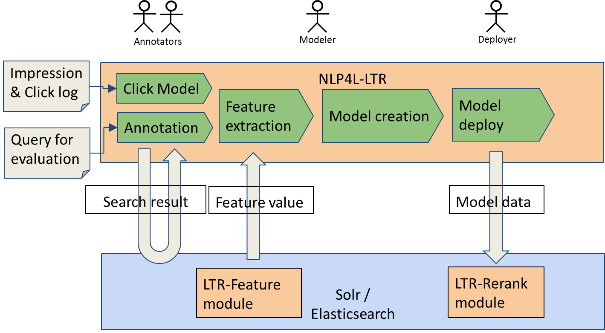
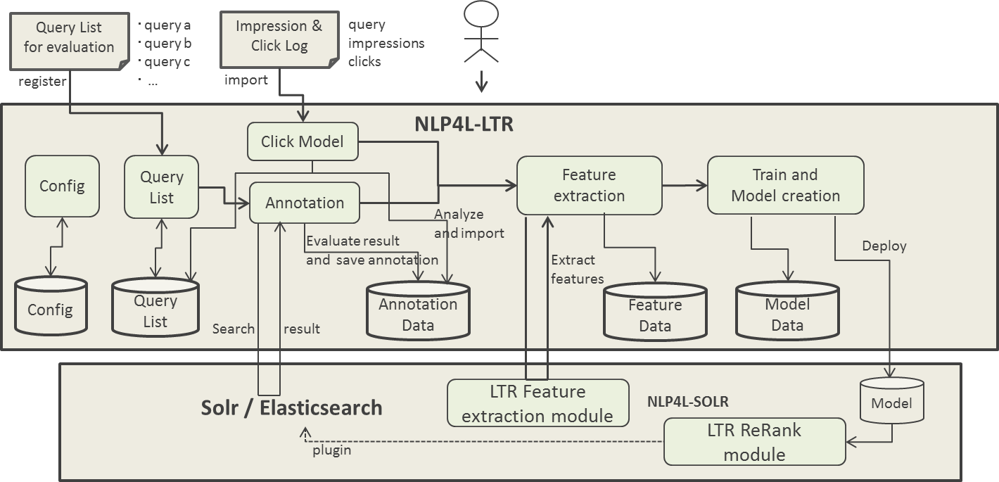

# NLP4L-LTR Learning-to-Rank Tool

## Concept

NLP4L-LTR provides a solution necessary to build the Learning-to-Rank function into a search engine (Solr, Elasticsearch).

The framework for learning to rank is divided into the following phases.

1. Create training data
2. Extract Feature
3. Create model
4. Allocate model

Though there are variety of models related to the learning to rank, NLP4L-LTR can be used independent of a particular model. Therefore, when you are incorporating a program that implements a new learning to rank model, you only have to implement a few interfaces that this tool provides to run it on the framework of NLP4L-LTR.

### Creating Training Data

The learning to rank that NLP4L-LTR provides is supervised learning. You, therefore, need data that tells how a query is relevant to certain documents. One of the followings are required to prepare this data.

- Have Annotator processes Annotation.
- Analyze the click log and create the data.

These have both merits and demerits. Having Annotator processes Annotation can lead to more certainty but also lead to higher cost and annotation data may deteriorate as time goes on. Meanwhile, analyzing the click log is less costly but generates noises and its character likely depends on each application.

## Architecture

The architecture of learning to rank tool is as follows.

## Function Overview

Followings are the overview of functions provided by the learning to rank tool. Refer to the above diagram as you read through the contents.

### Config
Config processes a variety of settings in order to run the learning to rank tool.

- Select the annotation (Pointwise, Pairwise, Listwise)  (Currently, only Pointwise is supported) 
- Specify the URL of search server (Solr/Elasticsearch) (Currently, only Solr is supported) 
- Features get method, Feature item definition
- Specify documents id, titile, body field name
- Factory class name required to create learning model
- Factory class name for Deploy

### Query List
Query List manages the list of queries from which training data is created.

- Queries from which training data is created and their status.
- Upload registration from the query file.

### Annotation
Annotation performs search on server (Solr/Elasticsearch) and manually annotates each document on the search results. Annotation will be performed by using the GUI that this tool provides to mark certain numbers of stars on the documents according to their relevancy.

- Inquiring into the search server and displaying the list of result documents.
- Annotation and saving Annotation data.

### Click Model
(works in progress) 
 (執筆中) 

### Feature extraction

Work with the LTR-Feature module of Solr/Elasticsearch to obtain the Feature value regarding training data. The Feature data will be used to create models.

- Obtain the Feature value of training data.
- Work with the LTR-Feature module of Solr/Elasticsearch.
- Save the Feature data.

### Train and Model Creation

Use the above ranking training data to perform training and create model data.

For training, the learning model create Factory class set in Config is available and a variety of model implements can be used.

- Create model and machine learning using the ranking training data.
- Deploy created model to Solr/Elasticsearch.

Created/deployed models will work with the LTR-ReRank module of Solr/Elasticsearch and will be used as ReRank for searching.

## NLP4L Solr Project

The learning to rank tool works together with Solr/Elasticsearch side LTR module (Currently, only Solr is supported). 

Refer to "[NLP4L Solr Project](https://github.com/NLP4L/solr)" for Solr side functions and settings.

## Standard Models

NLP4L has the learning model creation class already implemented and built-in.

|model|approach|explanation|
|:--|:--|:--|
|PRank|Pointwise|model that uses PRank(Perceptron Ranking) algorithm|
|RankingSVM|PseudoPairwise|models that use SVM(Support Vector Machine). Artificially convert from Pointwise data to Pairwise data to process|

Refer to [NLP4L-LTR User's Guide](ltr_users_guide_ja.md) for these standard models.

## User Developed Models

NLP4L assumes that user will not only use built-in models but also develop their own models.

Refer to [NLP4L-LTR Programmer's Guide](ltr_programmers_guide_ja.md) for more details.