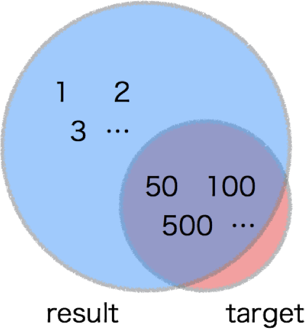
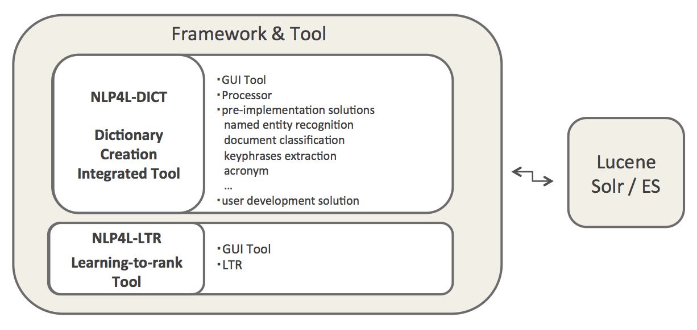

# Project Overview

* What is [NLP4L?](#What is NLP4L?)
* [Basic Strategy](#Basic Strategy)
* [Structure of NLP4L Project](#Structure of NLP4L Project)

## What is NLP4L?

NLP4L is a natural language processing tool written in Scala for [Apache Lucene](https://lucene.apache.org/core/). The main objective of NLP4L is to use NLP (Natural Language Processing) and machine learning technologies to improve the search experience of search engine users. "4L" in NLP4L means "for Lucene" and specifically targets search engines Lucene-based [Apache Solr](http://lucene.apache.org/solr/) and [Elasticsearch](https://www.elastic.co/products/elasticsearch). Note that the NLP4L strategy described in the following applies to information retrieval in general. NLP4L, therefore, can be used with anything including variety of commercial search engines other than Lucene.

By the way, what is exactly "improve the search experience of search engine users" means? In plain words, it means "enable users to find the documents they want in faster and easier manner". To realize this, NLP4L project aims for the followings.

1. Proposes methods and provide tools to improve the tradeoff relation of recall and precision. 
1. Creates dictionaries from corpora to provide search assistant tools (auto-complete, "Did you mean" search).
1. Provides a performance evaluation tool for information retrieval (will be released in the next major version). 


It is well known that we have two problems in information retrieval: "No Hit" and "Too Many Hits". "No Hit" means that the search engine is unable to return any document a user is searching. "Too Many Hits", meanwhile, is a case where the search engine returns so many documents including ones a user doesn't want that ones the user is looking for are hard to find. These indicators in technical terms are called "recall" and "precision" respectively.

This relation between "recall" and "precision" is well-known tradeoff. When you improve recall, that is, to tweak a search engine so that it preferably returns documents that users want in order to solve "No Hit" problem, the precision will go down, that is, "Too Many Hits" problem occurs. On the contrary, when you tweak the search engine so that it returns the only documents that users want to solve "Too Many Hits", the recall will decrease, that is, a "No Hit" problem occurs.


However, the real intension of information retrieval users is that they want a search engine to "return all documents they want but not return documents that they are not searching for". This is simultaneous pursuit of recall and precision. One of the functions that NLP4L wants to realize is this seemingly impossible function.

The second promise is that we will create dictionaries from corpora for the search assistant tools. The search assistant tools here mean "auto-complete" and "Did you mean search". These became common functions for search users after Google used them for some time. Lucene/Solr/Elasticsearch already provides these functions but the unit of suggestion is by the word. For example, when you type "n" in the search box, a word "new" may be suggested but you would not be so thrilled by that. Instead, you would be happier if "new york" or "new jersey" are suggested. In order to do that, these must be recognized as phrases. The second item NLP4L wants to realize is to enable you to extract character strings to be suggested (important words and important phrases) from an existing corpus to create a dictionary.

In addition, it would be useful if you could evaluate the change in information retrieval system performance before and after applying NLP4L or the type of model applied. To provide the information retrieval performance evaluation tool like this is the third purpose of NLP4L.

## Basic Strategy 

You cannot improve recall and precision at the same time as the both are in the relationship of tradeoff. The strategy that NLP4L uses, therefore, is to improve the recall first and then try to improve precision.

To try to improve recall in Lucene, applying SynonymFilter would be the way to go with. Typically, in order for users to use SynonymFilter, they would take a dictionary (text file) as follows and apply that to SynonymFilter.

```
International Monetary Fund, IMF
Massachusetts Institute of Technology, MIT
```

NLP4L provides a function that outputs a dictionary file like the above that reads in a corpus that users have and can be applied to Lucene SynonymFilter. Specifically, the following solution is provided to improve recall.

|Solution|Type|Processor|
|:----------|:----:|:------------|
|Acronym Extraction|recall|AcronymExtractionProcessor|
|Loanword Extraction   |recall|LoanWordsExtractionProcessor (TBD)|

As the above mentioned theory states, precision deteriorates when recall improves. NLP4L improves this deteriorated precision as follows.

* Incremental Precision Improvement
* Ranking Tuning

### Incremental Precision Improvement

In Solr, incremental precision improvement means refining search results using facet function.

As a specific example, let's look at a case where you are looking for a watch on the eBay site. The following diagram shows the search result of "watch" that lists so many watches.


If you see a refinement link "Men's" in addition to a list of search results, you can narrow down the search results as follows by clicking the link.


Likewise, if a refinement link "Price Range" is provided, you can narrows down the watches by clicking a link according to your budget.


To realize a refinement search using a facet like this, search target documents must be structured as follows.

| ID | Product | Price | Gender |
|:--:|:-----------|:-------:|:--------:|
| 1 |CURREN New Men’s Date Stainless Steel Military Sport Quartz Wrist Watch|8.92|Men's|
| 2 |Suiksilver The Gamer Watch    |87.99|Men's|

However, there are a lot of unstructured documents including newspaper articles. You cannot run refinement search using facet in those cases.

NLP4L provides a function that adds search axis for refinement using such unstructured search target documents. Specifically, the solution like below will be provided to improve precision.

|Solution|Type|Processor|
|:----------|:----:|:------------|
|Named Entity Extraction|Precision|OpenNLPNerProcessor|
|Document Classification|Precision|ClassificationProcessor|
|Keyphrase Extraction|Precision|KeyphraseExtractionProcessor|
|Buzzword Extraction |Precision|TermsExtractionProcessor (TBD)|


### Ranking Tuning

The "ranking" is document display order of search results. The following diagram describes a case of inappropriate ranking after a query run.



Numbers in the diagram indicate ranks. If the ranking is not appropriate, documents that the user is looking for are listed in the lower place in the search result and are hard to find.

If you can successfully tune the rankings, documents that the user is looking for are listed in the higher place in the search result as follows and can be found at once. 


The function that performs this tuning automatically is called learning to rank. NLP4L provides the following function as this learning to rank generally is supervised learning.

* Provide the annotation GUI that you can use to create training data for learning to rank.
* Create learning to rank models.
* Provide re-ranking modules for Solr/Elasticsearch that use the created learning to rank models.

### Using Corpus and Providing Dictionary Review GUI

Finally, the NLP4L basic strategy includes the following items.

* Use corpora as enterprise assets.
* Provide the GUI for dictionary review.

As described in the above, NLP4L provides a function to generate a wide variety of dictionaries in order to improve recall and precision of information retrieval. Enterprises that use information retrieval tools have corpora - language resource database - and NLP4L project encourages them to use each enterprise's distinctive corpora to generate dictionaries. Of course, you can use a general purpose corpus like wikipedia to generate a dictionary, but a car manufacturer could obtain dictionaries that better suited for their operation by using documents related to car manufacturing that the company has to create a corpus. Note that if the  corpus is not a simple text file, you can refer to the programmer's guide and write preprocessor to make the file readable.

While NLP4L uses natural language processing and machine learning techniques to create dictionaries, the NLP4L project is based on the presupposition "natural language processing and machine learning are not perfect". The project ,therefore, provides a GUI to manually review a dictionary auto-generated from a corpus before applying to the production system. We also have considered a case where the corpus has changed and you created a dictionary again and provided this GUI with the replay function that saves you from repeating the previous manual dictionary editing work. It also comes with the validation function that check the validity of dictionary before downloading or deploying it.

## Structure of NLP4L Project

In summary, the NLP4L project consists of "Dictionary Creation Integration Tool (NLP4L-DICT)" and "Learning to Rank Tool (NLP4L-LTR) ".

- Provides variable solutions as frameworks and tools.
	- NLP4L-DICT (Dictionary Creation Integration Tool)
	- NLP4L-LTR (Learning to Rank Tool)
- Provide standard implemented components and solutions in advance,
	- Named Entity Extraction, Document Classification, Keyphrase Extraction, Acronym Extraction …
	- LTR (Learning-to-Rank)
- In addition, user can develop unique solutions as well.




